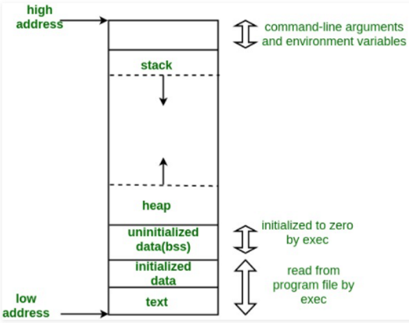

# C/C++ Interview Questions


```cpp
#include<stdio.h>
#include <iostream>
#include <bits/stdc++.h>
using namespace std;
```

### Q) Structure and Dynamic Memory

In C, you can define a structure and allocate memory using `malloc`:

```c
struct Node {
    int data;
    struct Node* next;
};

struct Node* n1 = (struct Node*)malloc(sizeof(struct Node));
n1->data = 1;
n1->next = NULL;
```

In C++, it's more common to use a `class` with a constructor for initialization and the `new` keyword for dynamic allocation:

```cpp
class Node
{
public:
    int data;
    Node* next;

    // Constructor
    Node(int data, Node *next)
    {
        this->data = data;
        this->next = next;
    }
};

Node *n1 = new Node(1, NULL);
```


### Q) Dynamic Memory Allocation

To dynamically allocate an array of 10 integers in C, you can use `malloc`.

```c
int *p = malloc(sizeof(int)*10);
```

#### Q) malloc()

  * The `malloc()` function allocates memory during program execution.
  * It does not initialize the allocated memory; the memory contains garbage values.


#### Q) calloc()

  * The `calloc()` function is similar to `malloc()`, but it initializes the allocated memory to zero.

### Q) What is the use of a static variable in C?

  * A **static variable** retains its value between multiple function calls.
  * Its scope is available throughout the entire program.
  * If not explicitly initialized, a static variable is automatically initialized to zero.

<!-- end list -->

```c
void f() {
    static int i; // Initialized to 0 only once
    ++i;
    printf(“%d “, i);
}
```

### Q) What is a pointer in C?

A **pointer** is a variable that stores the memory address of another variable.

```c
int a = 5;
int *p; // p is a pointer to an integer
p = &a; // p now holds the address of a
```


### Q) NULL Pointer in C

  * A **NULL pointer** is a pointer that does not point to any memory address.
  * Assigning a `0` value or the `NULL` macro to a pointer makes it a NULL pointer.


### Q) Far Pointer in C

  * A **far pointer** is a 32-bit pointer that can access memory outside the default memory segment.
  * It was primarily used in 16-bit segmented memory architectures (like MS-DOS) to access the entire 1MB of addressable memory.


### Q) What is Dangling Pointer in C++

  * A **dangling pointer** points to a memory location that has already been deallocated (freed).
  * This occurs when `free()` is called on a block of memory, but the pointer that was pointing to it is not set to `NULL`.

<!-- end list -->

```c
int *ptr = malloc(sizeof(int)); // Allocate memory
free(ptr);                     // Deallocate memory, ptr is now a dangling pointer
ptr = NULL;                    // ptr is no longer a dangling pointer
```


### Q) Polymorphism in C++

**Polymorphism** means "many forms." It allows objects to behave differently in different situations.

  * **Compile-Time Polymorphism**: Achieved through function overloading and operator overloading. The compiler resolves which function to call at compile time.
  * **Runtime Polymorphism**: Achieved through virtual functions and function overriding. The decision on which function to call is made at runtime.


### Q) Toggling the k-th Bit of a Number

You can toggle the k-th bit of a number `n` using the XOR (`^`) operator.

  * `return (n ^ (1 << (k - 1)));`


### Q) Constructor and Destructor Calling Order

For inherited classes, the order of execution is:

1.  **Parent Constructor** -\> **Child Constructor**
2.  **Child Destructor** -\> **Parent Destructor**


### Q) Void Pointers

  * A `void` pointer is a generic pointer that has no associated data type. It can hold the address of any type of variable.

<!-- end list -->

```c
void *ptr;
char *str = "Hello";

ptr = str;      // Valid: a pointer of any type can be assigned to a void pointer.
// str = ptr;   // Error: a void pointer cannot be assigned to a typed pointer directly.
str = (char*)ptr; // Valid: explicit type casting is required.
```


### Q) Abstract Class in C++

  * An **abstract class** is a class that has at least one **pure virtual function**.
  * A pure virtual function is a virtual function with no definition, declared by assigning `= 0`.
  * You cannot create an object of an abstract class.
  * Derived classes must provide an implementation for all pure virtual functions of the base class.


### Q) Data Abstraction in C++

**Data abstraction** refers to the concept of hiding complex implementation details and showing only the essential features of the object. It helps in managing complexity by separating the interface from the implementation.


### Q) C++ Friend Function

A **friend function** of a class is a non-member function that is granted access to the `private` and `protected` members of that class.

**Syntax:**

```cpp
class MyClass
{
    friend return_type function_name(arguments);
};
```

**Example:**

```cpp
#include <iostream>

class Box
{
private:
    int length;
public:
    Box(): length(0) { }
    friend int printLength(Box b); // Friend function declaration
};

// Friend function definition
int printLength(Box b)
{
   b.length += 10; // Can access private member 'length'
   return b.length;
}

int main()
{
    Box b;
    std::cout << "Length of box: " << printLength(b) << std::endl;
    return 0;
}
```


### Q) Inheritance

**Inheritance** is a mechanism where a new class (derived class) inherits properties and behaviors from an existing class (base class).

```cpp
class Account { /* ... */ };

// Programmer class inherits publicly from Account
class Programmer : public Account {
public:
    float bonus = 5000;
};
```


### Q) Copy Constructor

  * A **copy constructor** is a special constructor that initializes a new object as a copy of an existing object.
  * **Syntax:** `ClassName(const ClassName &old_object);`

**Example:**

```cpp
#include <iostream>
using namespace std;

class A
{
public:
    int x;
    // Parameterized constructor
    A(int a)
    {
        x = a;
    }
    // Copy constructor
    A(const A &i)
    {
        x = i.x;
    }
};

int main()
{
    A a1(20);      // Calls parameterized constructor
    A a2(a1);      // Calls copy constructor
    cout << a2.x;  // Outputs 20
    return 0;
}
```


### Q) Fixing Memory Leaks

To prevent memory leaks, you must `delete` any memory that you allocate with `new`. It is also good practice to set the pointer to `NULL` after deleting it to avoid creating a dangling pointer.

```cpp
Person* p3 = new Person();
p3->printFunc();

// Proper cleanup
if (p3 != NULL)
{
    delete p3;
    p3 = NULL;
}
```

-----

### Q) Storage Classes in C : 

C language uses 4 storage classes, namely:

| Storage Specifier | Storage | Initial value | Scope | Life |
| :--- | :--- | :--- | :--- | :--- |
| **auto** | stack | Garbage | Within block | End of block |
| **extern** | Data segment | Zero | global Multiple files | Till end of program |
| **static** | Data segment | Zero | Within block | Till end of program |
| **register** | CPU Register | Garbage | Within block | End of block |


### Q) Memory Layout of C Programs :

A typical memory representation of a C program consists of the following sections:

1.  Text segment (i.e. instructions)
2.  Initialized data segment
3.  Uninitialized data segment (bss)
4.  Heap
5.  Stack




### Q) Example of Passing by Pointer:

```cpp
// C++ program to swap two numbers using pass by pointer

#include <iostream>
using namespace std;

void swap(int *x, int *y)
{
    int z = *x;
    *x = *y;
    *y = z;
}

// Driver Code
int main()
{
    int a = 45, b = 35;
    cout << "Before Swap\n";
    cout << "a = " << a << " b = " << b << "\n";

    swap(&a, &b);

    cout << "After Swap with pass by pointer\n";
    cout << "a = " << a << " b = " << b << "\n";
}
```


### Q) Example of Passing by Reference:

```cpp
// C++ program to swap two numbers using pass by reference
#include <iostream>
using namespace std;

void swap(int& x, int& y)
{
    int z = x;
    x = y;
    y = z;
}

int main()
{
    int a = 45, b = 35;
    cout << "Before Swap\n";
    cout << "a = " << a << " b = " << b << "\n";

    swap(a, b);

    cout << "After Swap with pass by reference\n";
    cout << "a = " << a << " b = " << b << "\n";
}
```


### Q) Difference between malloc() and calloc()?

| Feature | `calloc()` | `malloc()` |
| :--- | :--- | :--- |
| **Description** | Allocates multiple blocks of requested memory. | Allocates a single block of requested memory. |
| **Initialization** | Initializes the content of the memory to zero. | Does not initialize the content of memory, so it contains garbage values. |
| **Number of arguments** | It consists of two arguments. | It consists of only one argument. |
| **Return value** | It returns a pointer pointing to the allocated memory. | It returns a pointer pointing to the allocated memory. |


### Q) Polymorphism

  * **Polymorphism**
      * **Compile Time**
          * Method Overloading
          * Operator Overloading
      * **Run Time**
          * Virtual Function
          * Function Overriding

### Q) Compare compile time polymorphism and Runtime polymorphism

| Feature | Compile-time polymorphism | Run time polymorphism |
| :--- | :--- | :--- |
| **Resolution** | The call is resolved by the compiler at **compile time**. | The call is resolved at **run time**. |
| **Execution Speed**| Provides **fast execution** as the method is known beforehand. | Provides **slower execution** as the method is identified during runtime. |
| **Achieved By** | **Function overloading** and **operator overloading**. | **Virtual functions** and **pointers**. |

#### Compile-time Polymorphism: Function Overloading

In this example, the compiler knows exactly which `add()` function to call based on the number of arguments provided. This decision is made at compile time.

```cpp
#include <iostream>

// Two functions with the same name but different parameters
int add(int a, int b) {
    return a + b;
}

int add(int a, int b, int c) {
    return a + b + c;
}

int main() {
    // Compiler knows which add() to call
    std::cout << add(2, 3) << std::endl;      // Calls the two-argument version
    std::cout << add(2, 3, 4) << std::endl;  // Calls the three-argument version
    return 0;
}
```

#### Run-time Polymorphism: Virtual Functions

Here, the `virtual` keyword tells the compiler to wait until run time to decide which `fun()` method to call. Since the base class pointer `a` points to a derived class object `B`, the derived class's version of the function is executed.

```cpp
#include <iostream>

class A {
public:
    // Virtual function
    virtual void fun() {
        std::cout << "base ";
    }
};

class B : public A {
public:
    // Overriding the virtual function
    void fun() {
        std::cout << "derived ";
    }
};

int main() {
    // Pointer of base type points to a derived class object
    A* a = new B;

    // The correct fun() is called at run time
    a->fun(); // Outputs: derived

    delete a;
    return 0;
}
```


### Q) Inheritance :

```cpp
// C++ Implementation to show that a derived class
// doesn't inherit access to private data members.
// However, it does inherit a full parent object.

class A
{
public:
    int x;
protected:
    int y;
private:
    int z;
};

class B : public A
{
    // x is public
    // y is protected
    // z is not accessible from B
};

class C : protected A
{
    // x is protected
    // y is protected
    // z is not accessible from C
};

class D : private A   // 'private' is default for classes
{
    // x is private
    // y is private
    // z is not accessible from D
};
```


## References:

- https://www.geeksforgeeks.org/storage-classes-in-c/