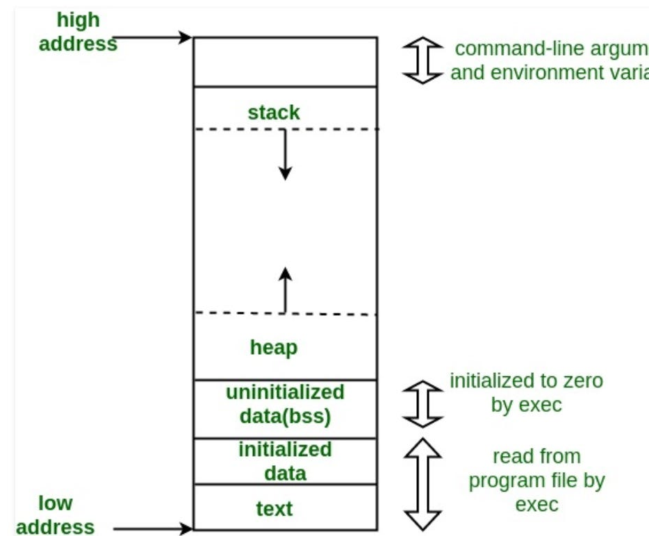

# Essential Fundamentals

### How Computer Works
Computer works on binary number system. Because it's based on electronic, and in electronic, signals are low or high which means 0 or 1.


### Number Systems
- Binary = {0, 1}
- Octal = {0, 1, 2, 3, 4, 5, 6, 7}
- Decimal = {0, 1, 2, 3, 4, 5, 6, 7, 8, 9}
- HexaDecimal = {0, 1, 2, 3, 4, 5, 6, 7, 8, 9, A, B, C, D, E, F}

Decimal | Binary | Octal | HexaDecimal
-- | -- | -- | --
0 | 0 | 0 | 0
1 | 1 | 1 | 1
2 | 10 | 2 | 2
3 | 11 | 3 | 3
4 | 100 | 4 | 4
5 | 101 | 5 | 5
6 | 110 | 6 | 6
7 | 111 | 7 | 7
8 | 1000 | 10 | 8
9 | 1001 | 11 | 9
10 | 1010 | 12 | A
11 | 1011 | 13 | B
12 | 1100 | 14 | C
13 | 1101 | 15 | D
14 | 1110 | 16 | E
15 | 1111 | 17 | F
16 | 10000 | 18 | 10

- Computer is a programmable computation device.
- A Program contains Data and set of Instructions.
- **Intermediate language between human language and machine language is called programming language.**

### Low-level, High-Level & Hybrid Languages

- #### Low level language :
    - Machine Language (Binary)
    - Assembly

- #### High level languages :
    - C, C++, Java, Python, C#, etc
    - Compiler bases languages : C++
    - Interpreter based languages : Javascript
    - Hybrid languages

- #### Hybrid Languages :
    - Java, dot net languages - C#
    - They have both compiler and interpreter.
    - It's 2 step stages.
    - Compiler just  check for error, not generate machine code, it's just byte code. JVM (interpreter) will generate machine code and also execute.
    - Interpreter for byte code not for source code.


### Compiler vs Interpreter

- #### Compiler :
    - Compiler converts source code to machine code (only if no error).
    - Generate executable file.
    - For running program we don’t require compiler.
    - Compiler programs are faster, run independently.

- #### Interpreter :
    - Chrome works is an interpreter for java script.
	- Chrome translate one line and execute it also.
	- Line by line translation as well execution.
	- Will not create exe file.
	- Interpreter languages are easier compared to compiler based languages.
    - Example : Preparing a Chinese dish from reading a Chinese recipe book.

### Operating System : A Master Program


# Program Development

### Programming Paradigm

- There are many type of Programming Paradigm, like Imperative, procedural, functional, declarative, object oriented, etc.


### Flow Chart

- A flowchart is a type of diagram that represents a workflow or process.
- A flowchart can also be defined as a diagrammatic representation of an algorithm.
- It's a step-by-step approach to solving a task.
- Example :


### Steps for Program Development and Execution

- Coding/Editing
- Compiling
- Linking Library (Header Files)
- Loading (Bringing program from hard disk to main memory)
- Execution

### Main Memory divided into 4 sections

- #### Stack :
    - Used to store local variables and function call information
    - Each function call creates a new stack frame, and local variables are allocated within that frame.
    - Memory allocated on the stack is automatically reclaimed when a function exits.

- #### Heap :
    - Used for dynamic memory allocation
    - Memory allocated on the heap persists until explicitly deallocated by the programmer.

- #### Code Section (Text Section) :
    - Machine code copied into code section.
    - Holds the executable code of a program.

- #### Data Section :
    - Contains global and static variables used by the program
    - **Initialized Data Section :**
        - Holds initialized global and static variables.
        - The values of these variables are set at compile time.
    - **Uninitialized Data Section (BSS - Block Started by Symbol) :**
        - Holds uninitialized global and static variables.
        - The values of these variables are initialized to zero during program startup.
    ```cpp
    int initializedVariable = 42;   // Goes to the Initialized Data Section
    int uninitializedVariable;      // Goes to the BSS Section
     ```

