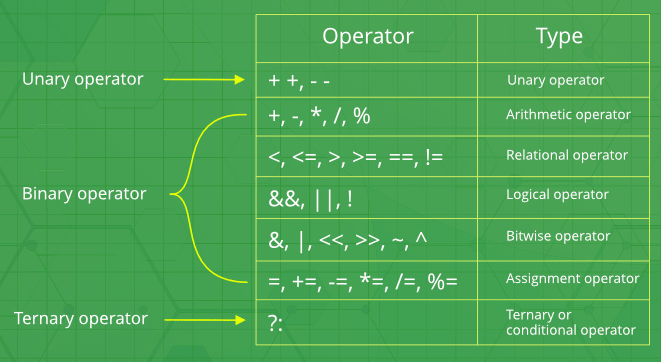
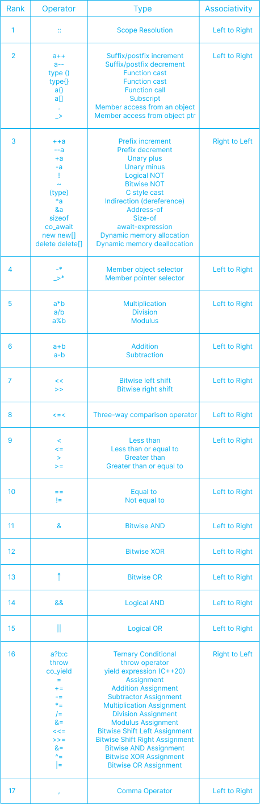

# Operators

- Operators are used to perform operations on variables and values.
- We use `+` operator to add together two values : `int x = 100 + 50;`

    

- C++ divides the operators into the 5 groups :

### Arithmetic operators

- Used to perform common mathematical operations.
- `+, -, *, /, %, ++, --`
- Addition, Subtraction, Multiplication, Division, Modulus, Increment, Decrement
  
    #### Increment/Decrement Operator :
    - The increment operator adds 1 to the current value of the variable.
    - The decrement operator subtract 1 to the current value of the variable.
    - It can be used in both postfix and prefix forms.
    
    #### Postfix (variable++) & Prefix (++variable) increment :
    ```cpp
    // postfix_operators.cpp

    int x = 2;
    int resultX = x++;  // Postfix increment
    cout << x << ", " << resultX << endl;    // Now, x is 3, and resultX is 2

    int y = 5;
    int resultY = ++y;  // Prefix increment
    cout << y << ", " << resultY << endl;    // Now, x is 6, and resultY is 6
    ```

### Assignment operators

- Used to assign values to variables.
- `=, +=, -=, *=, /=, %=, &=, |=, ^=, >>=, <<=`

### Comparison operators

- Used to compare variables.
- The return value of a comparison is either 1 or 0, which means true (1) or false (0).
- These values are known as Boolean values.
- `==, !=, >, <, >=, <=`
- Equal to, Not equal, Greater than, Less than, Greater than or equal to, Less than or equal to

### Logical operators

-  Used to perform logical operations on boolean values.
-  The result of a logical operation is a boolean value, which can be either true or false. 
-  `&&` is Logical and. Returns true if both statements are true.
    -  `x < 5 &&  x < 10`
- `||` is Logical or. Returns true if one of the statements is true.
    - `x < 5 || x < 4`
- ! is Logical not. Reverse the result, returns false if the result is true.
    - `!(x < 5 && x < 10)`
- These logical operators can be combined to create more complex logical expressions.

### Bitwise operators

- Used to perform operations at the bit level.
- These operators work on the individual bits of binary numbers. 

    #### AND (&) :
    - Performs a bitwise AND operation between each pair of corresponding bits of a and b.
    - **Syntax : `x & y`. The result is 1 only if both bits are 1.**

    #### OR (|) :
    - Performs a bitwise OR operation between each pair of corresponding bits of a and b.
    - **Syntax : `x | y` : The result is 1 if at least one of the bits is 1.**

    #### XOR (^) :
    - Performs a bitwise exclusive OR (XOR) operation between each pair of corresponding bits of a and b.
    - **Syntax : `x ^ y`. The result is 1 if the bits are different.**

    #### NOT (~) :
    - Performs a bitwise NOT operation on each bit of a.
    - **Syntax : `~a`. It flips each bit, changing 1s to 0s and vice versa.**

    #### Left Shift (<<) :
    - **Syntax : `x << n`. Shifts the bits of a to the left by n positions.**
    - The vacant positions on the right are filled with zeros.

    #### Right Shift (>>) :
    - **Syntax : `x >> n`. Shifts the bits of a to the right by n positions.**
    - The vacant positions on the left are filled based on the sign bit for signed integers (arithmetic shift), or with zeros for unsigned integers (logical shift).
    - **Right Shift with Unsigned Integers (Logical Shift) :**
        - When you right-shift an unsigned integer, the behavior is called a logical shift.
        - In a logical shift, vacant positions are filled with zeros, regardless of the sign bit.
        - `unsigned int num = 8;  // Binary: ...0000000000001000`
        - `unsigned int result = num >> 1;  // Result: ...0000000000000100 (zeros filled)`
    - **Right Shift with Signed Integers (Arithmetic Shift) :**
        - When you right-shift a signed integer, the behavior is called an arithmetic shift.
        - In an arithmetic shift, the sign bit (the leftmost bit) is used to fill the vacant positions created by the shift.
        - If the sign bit is 1 (indicating a negative number), it will be replicated to fill the empty positions.
        - `int num = -8;  // Binary: ...1111111111111000`
        - `int result = num >> 1;  // Result: ...1111111111111100 (sign bit replicated)`
    
    ```cpp 
    // bitwise_operator.cpp :

    unsigned int a = 5;  // Binary: 0101
    unsigned int b = 3;  // Binary: 0011

    // Bitwise AND
    cout << (a & b) << endl;  // Output: 1 (Binary: 0001)

    // Bitwise OR
    cout << (a | b) << endl;  // Output: 7 (Binary: 0111)

    // Bitwise XOR
    cout << (a ^ b) << endl;  // Output: 6 (Binary: 0110)

    // Bitwise NOT
    cout << (~a) << endl;  // Output: 4294967290 (Binary: 11111111111111111111111111111010)

    // Left Shift
    cout << (a << 1) << endl;  // Output: 10 (Binary: 1010)

    // Right Shift (a is unsigned so it's Logical Shift)
    cout << (a >> 1) << endl;  // Output: 2 (Binary: 0010)

    // Right Shift (num is signed so it's Arithmetic Shift)
    int num = -8;  // Binary: ...1111111111111000`
    cout << (num >> 1) << endl;  // Output: ...1111111111111100 (sign bit replicated)
    ```


### Operator Precedence

- Operator precedence determines the order in which operators are evaluated in an expression.
- When an expression contains multiple operators, the one with higher precedence is evaluated first.
- If two operators have the same precedence, their associativity (left-to-right or right-to-left) determines the order of evaluation.

    


#### References :

- https://www.prepbytes.com/blog/cpp-programming/cpp-operator-precedence/