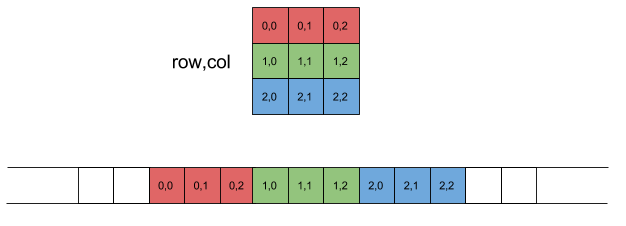

# Arrays

- An array is a collection of elements of the same data type, stored in contiguous memory locations.
- The elements in an array are accessed using an index, which starts from 0 for the first element.
- To declare an array :
    - define the variable type,
    - specify the name of the array followed by square brackets and
    - specify the number of elements it should store:
- `string cars[4];`
- `int myNum[3] = {10, 20, 30};`

### Omit Array Size 
- We don't have to specify the size of the array.
- The compiler is smart enough to determine the size of the array based on the number of inserted values:
- `string cars[] = {"Volvo", "BMW", "Ford"};`   // Size is 3 automatically
  
### Omit Elements on Declaration
- It is also possible to declare an array without specifying the elements on declaration, and add them later
- `string cars[5]; cars[0] = "Volvo"; cars[1] = "BMW"; ...`
- `int numbers[5] = {1, 2};`   // {1, 2, 0, 0, 0}
    - Other values will be 0 by-default.

### Get the Size of an Array
- To get the size of an array, you can use the `sizeof()` operator:
- `sizeof(myNumbers);`  // myNumbers is name of array

### Accessing Elements
- `int elementAtIndexTwo = myArray[2];` // Retrieves the element at index 2

### Simple Array Program

```cpp
// array.cpp

// Declaration and initialization of an integer array
int myArray[5]; // Declares an array of 5 integers

// Initializing elements individually
myArray[0] = 10;
myArray[1] = 20;
myArray[2] = 30;
myArray[3] = 40;
myArray[4] = 50;

// Declaration and initialization in one line
int anotherArray[] = {1, 2, 3, 4, 5}; // Compiler determines the size

// Getting the size of an array
int sizeOfArray = sizeof(myArray) / sizeof(myArray[0]);

// Output array
for (int i = 0; i < sizeOfArray; i++) {
    cout << myArray[i] << " ";
}

cout << endl;

// Output anotherArray using for-each
for (int i : anotherArray) {
    cout << i << " ";
}
```

## Multidimensional Arrays:

- A multi-dimensional array is an array of arrays, where each element of the array is itself an array.
-  We can have 2-Dimensional arrays, 3-Dimensional arrays, and so on.
-  To declare a multi-dimensional array,
    - define the variable type,
    - specify the name of the array followed by square brackets which specify how many elements the main array has,
    - followed by another set of square brackets which indicates how many elements the sub-arrays have:
    - `string array2D[2][4];`
    ```cpp
    // 2D Array :
    string array2D[2][4] = {
        { "A", "B", "C", "D" },
        { "E", "F", "G", "H" }
    };

    // 3D Array :
    string array3D[2][2][2] = {
        {
            { "A", "B" },
            { "C", "D" }
        },
        {
            { "E", "F" },
            { "G", "H" }
        }
    };
    ```

- 2D array representation in memory :
    
- In reality it's a single dimension array.
- `int A[2][3]={2,4,6,3,5,7};    // works same as A[2][3]={{2,4,6},{3,5,7}};`

#### Access the Elements of a Multi-Dimensional Array :
- To access an element of a multi-dimensional array, specify an index number in each of the array's dimensions :
    ```cpp
    cout << array2D[0][2];  // Outputs "C"`
    ```
#### Change Elements in a Multi-Dimensional Array :
- To change the value of an element, refer to the index number of the element in each of the dimensions 
    ```cpp
    array2D[0][0] = "Z";
    cout << array2D[0][0];  // Now outputs "Z" instead of "A"
    ```

#### Loop Through a Multi-Dimensional Array :
- To loop through a multi-dimensional array, we need one loop for each of the array's dimensions :
    ```cpp
    // 2D Array :
    for (int i = 0; i < 2; i++) {
        for (int j = 0; j < 4; j++) {
            cout << array2D[i][j] << "\n";
        }
    }

    // 3D Array :
    for (int i = 0; i < 2; i++) {
        for (int j = 0; j < 2; j++) {
            for (int k = 0; k < 2; k++) {
                cout << array3D[i][j][k] << "\n";
            }
        }
    }
    ```

#### Why we need Multi-Dimensional Arrays?
- Multi-dimensional arrays are great at representing grids.
- Spatial Representation: In computer graphics, 2D and 3D arrays are commonly used to represent images and three-dimensional spaces, respectively. Each element in the array corresponds to a pixel.

### Using Reference in Array

- **Reference** : Giving another name to same value
    - `int &x = y;   //  x is a reference to the variable y;`

    ```cpp
    // reference_in_array.cpp

    int array[5] = {1, 2, 3, 4, 5};

    for (int i : array) {
        ++i;    // will not change original value of array
    }
    for (int i : array) {
        cout << i << " ";   // output : 1 2 3 4 5
    }

    cout << endl;

    for (int &i : array) {  // using Reference : Giving another name to same value
        ++i;    // array value will also get modify
    }
    for (int i : array) {
        cout << i << " ";   // output : 2 3 4 5 6
    }

    // Using for each and reference in 2d array

    string array2D[2][3] = { {"00", "01", "02"}, {"10", "11", "12"} };

    for (auto &i : array2D) {
        for (auto &j : i) {
            cout << j << " ";   // output : 00 01 02, 10 11 12
        }
        cout << endl;
    }

    ```
- `for(int &x : array)`: This is a range-based for loop in C++.
- The loop variable i is declared as a reference to an integer (`int &i`), meaning that `i` will refer directly to the actual elements in the container `array`, rather than creating a copy of them.
- `++i;`: This line increments the value referred to by `i`. Since `i` is a reference to the elements in the container `array`, this operation modifies the original values in the array.
- We can use `auto` instead of `int` if we don't know data type. This will not work on pointer. Work only on collection of values, like vector, list, et

## Standard Template Library (STL) Arrays:

- C++ also provides the `std::array` template class as part of the Standard Template Library:
- Using `std::array` provides additional benefits, such as bounds checking and compatibility with other STL algorithms.
- In C++ **Arrays have fixed sizes**, and modifying their size requires creating a new array. If we need a dynamic-size array, consider using `std::vector` from the STL.

    ```cpp
    #include <array>

    // Declaration and initialization of a std::array
    array<int, 5> stlArray = {10, 20, 30, 40, 50};

    // Accessing elements
    int value = stdArray[2];    // Retrieves the element at index 2
    int value2 = stlArray.at(0);    // Retrieves the element at index 0
    ```


### Extras :

- We can use exit(0); for termination of program.