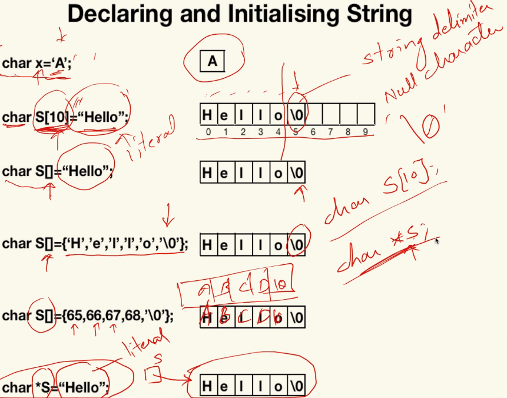

# Strings

- We have char array which is available in c & c++.
- We have class String which is only available in c++.
- Let's first understand char array:

### Char Array

- Different ways of declaring and initializing string using char array:
    ```cpp
    // char_array.cpp

    char arr1 = 'a';
    char arr2[10] = "Hello";
    char arr3[] = "Hello";
    char arr4[] = {'H', 'e', 'l', 'l', 'o', '\0'};
    char arr5[] = {65, 66, 67, 68, 69, '\0'};
    char *arr6 = "Hello";   // warning: ISO C++ forbids converting a string constant to 'char*'
    const char *arr7 = "Hello"; // to fix arr6 warning, add const

    cout << "arr1 = " << arr1 << endl;      // a
    cout << "arr2 = " << arr2 << endl;      // Hello
    cout << "arr3 = " << arr3 << endl;      // Hello
    cout << "arr4 = " << arr4 << endl;      // Hello
    cout << "arr5 = " << arr5 << endl;      // ABCDE
    cout << "arr6 = " << arr6 << endl;      // Hello
    cout << "arr7 = " << arr7 << endl;      // Hello
    ```
- Use Single Quotes for char `''`
- use Double Quotes for string `""`
- Declaring & Initializing String:  
    
- Literals are created in code section.
    -  a literal is a notation for representing a fixed value in source code.
    -  literals can be used to represent constants of various types, such as integers, floating-point numbers, characters, and more
- If we want a string in heap, go for character pointer.
- If you want in stack, then go for character array.
- Null character = `'\0'` (or 0 numeric)
- just `cin` only takes characters to the first white space.
- `cin.getline()` reads input up to `'\n'` and stops
- `cin.get()` reads input up to `'\n'` and keeps `'\n'` in the stream
- `cin.getline()` reads a whole line, up to, but not including the Enter key.
- `cin.get()` is the same, except it keeps the newline character. 
- Example:
    ```cpp
    // char_array.cpp

    char name[20];
    cout << "Enter name: "; 
    cin >> name;    // Reads until the first whitespace character, read only first word not whole sentence
    cout << "name = " << name << endl;  // Rajat
    cin.ignore();   // to handle any leftover newline characters or other unwanted characters in the input buffer

    // cin.get() is used for accessing character array
    char data[20];
    cout << "Enter Something for cin.get(): ";
    cin.get(data, 20);   //  get will not read enter key, second string will take that enter as '\n' string
    cout << "data = " << data << endl;      // How are you?
    cin.ignore();   // to handle any leftover newline characters or other unwanted characters in the input buffer

    // `cin.getline()` reads input up to `'\n'` and stops (no need to use cin.ignore())
    char data2[20];
    cout << "Enter Something for cin.getline(): ";
    cin.getline(data2, 20);
    cout << "data2 = " << data2 << endl;    // I am fine
    ```
- This will also work:
    ```cpp
    char *s;
    cout<<"Enter a String";
    cin>>s;
    cin.getline(s, 100);
    ```

### Char Array/String built-in functions

- Need to include `#include <ctring>` or `#include <string.h>`
- `strlen(s)`   // for string length
    ```cpp
    // strlen: String Length

    char str[] = "Hello";
    int length = strlen(str);
    cout << "Length of string: " << length << endl;     // 5
    ```
- `strcat(destination, source)` // for concatenate strings, source string will added in destination string, destination will become destination + source.
    ```cpp
    // strcat: Concatenate strings

    char source[] = " World";
    char destination[20] = "Hello";
    strcat(destination, source);
    cout << "Concatenated string: " << destination << endl;     // Hello World
    ```
- `strncat(destination, source, number of letter of second string to concatenate with first)`   // Concatenate with limited characters
    ```cpp
    // strncat: Concatenate with limited characters

    char source2[] = " Universe";
    strncat(destination, source2, 4); // Concatenate only the first 4 characters of source2
    cout << "Partially concatenated string: " << destination << endl;   // Hello World Uni
    ```
- `strcpy(destination, source)` // copy source string to destination
    ```cpp
    // strcpy: Copy string

    char source3[] = "Copy";
    char destination2[20];
    strcpy(destination2, source3);
    cout << "Copied string: " << destination2 << endl;      // Copy
    ```
- `strncpy(destination,source, length)` // Copy string with limited characters
    ```cpp
    // strncpy: Copy string with limited characters
    char source4[] = "Partial Copy";
    char destination3[20];
    strncpy(destination3, source4, 7); // Copy only the first 7 characters of source4
    cout << "Partially copied string: " << destination3 << endl;    // Partial
    ```
- `strstr(main, sub)`   // to find substring, will crash if not found. Use if(strstr(s1,s2)!=NULL) {…}
    ```cpp
    // strstr: Find substring

    char mainStr[] = "Hello World";
    char subStr[] = "World";
    if (strstr(mainStr, subStr) != NULL) {
        cout << "Substring found!" << endl;     // Substring found!
    } else {
        cout << "Substring not found." << endl;
    }
    ```
- `strchr(main, char)`; // find occurrence of a character in string
    ```cpp
    // strchr: Find character occurrence

    char searchChar = 'o';
    char* charPtr = strchr(mainStr, searchChar);
    if (charPtr != NULL) {
        cout << "Character found at position: " << (charPtr - mainStr) << endl;     // 4
    } else {
        cout << "Character not found." << endl;
    }
    ```
- `strcmp(str1, str2)` ;    // compare 2 string, return -ve, 0 (when strings are same), +ve
    ```cpp
    // strcmp: Compare strings

    char str1[] = "Hello";
    char str2[] = "World";
    int comparisonResult = strcmp(str1, str2);
    cout << "Comparison result: " << comparisonResult << endl;      // -1
    ```
- `strtol(str1, NULL, 10)`  // string to long int, where 10 (decimal) is base
    ```cpp
    // strtol: String to long int

    char str3[] = "123";
    long intResult = strtol(str3, NULL, 10);
    cout << "String to long int: " << intResult << endl;    // 123
    ```
- `strtof(str1, NULL)`  // string to float
    ```cpp
    // strtof: String to float

    char str4[] = "3.14";
    float floatResult = strtof(str4, NULL);
    cout << "String to float: " << floatResult << endl;     // 3.14
    ```
- `strtok(str1, "=;")`  // to tokenize a string, where =; is token/delimiter.
    ```cpp
    // Example for strtok

    char str5[] = "key1=value1;key2=value2";
    char* token = strtok(str5, "=;");
    while (token != NULL) {
        cout << "Token: " << token << endl;     // Token: key1 
        token = strtok(NULL, "=;");             // Token: value1 .....
    }
    ```
- Working code with all above example is in `char_functions.cpp`

### Class String

