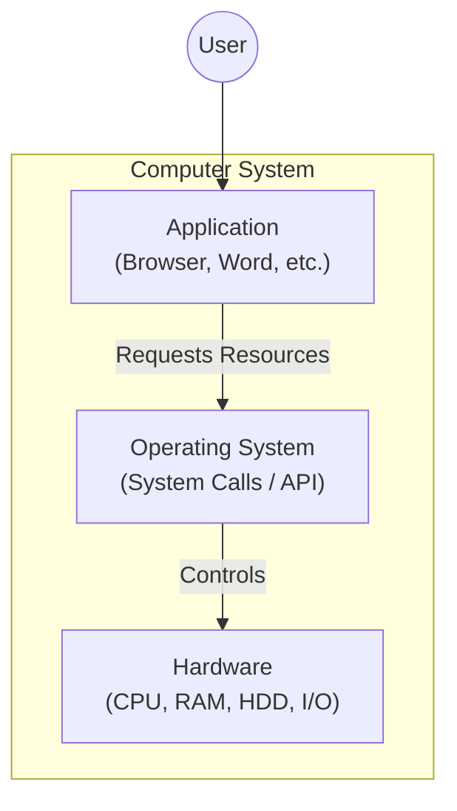

# Section 2: Essential Fundamentals

## How Computer Works
Computers work on the **Binary Number System**. This is because they are based on electronics, and electronic signals have two states:
* **0** (Low / Off)
* **1** (High / On)

### System Block Diagram
```mermaid
flowchart TD
    %% Styling
    classDef memory fill:#f9f,stroke:#333,stroke-width:2px;
    classDef storage fill:#ff9,stroke:#333,stroke-width:2px;
    
    subgraph CPU_Block [CPU]
        direction TB
        ALU[ALU]
        CU[CU]
    end

    subgraph Input_Flow [Input Process]
        IP[I/P Device] --> IB[I/P Buffer]
    end

    subgraph Output_Flow [Output Process]
        OB[O/P Buffer] --> OP[O/P Device]
    end

    MM[Main Memory]:::memory
    HDD[("HDD <br> (notepad.exe - Prog) <br> (My.txt - Data)")]:::storage

    %% Connections
    IB --> MM
    MM --> OB
    CPU_Block <--> MM
    HDD -->|Loads Data & Instructions| MM
````

-----

## Number Systems

### Concepts

  * **Computer:** A programmable computation device.
  * **Program:** Contains Data and a set of Instructions.
  * **Programming Language:** The intermediate language between human language and machine language.

### System Definitions

  * **Binary:** `{0, 1}`
  * **Octal:** `{0, 1, 2, 3, 4, 5, 6, 7}`
  * **Decimal:** `{0, 1, 2, 3, 4, 5, 6, 7, 8, 9}`
  * **Hexadecimal:** `{0, 1, 2, 3, 4, 5, 6, 7, 8, 9, A, B, C, D, E, F}`

### Conversion Table

| Decimal | Binary | Octal | Hexadecimal |
| :--- | :--- | :--- | :--- |
| **0** | 0 | 0 | 0 |
| **1** | 1 | 1 | 1 |
| **2** | 10 | 2 | 2 |
| **3** | 11 | 3 | 3 |
| **4** | 100 | 4 | 4 |
| **5** | 101 | 5 | 5 |
| **6** | 110 | 6 | 6 |
| **7** | 111 | 7 | 7 |
| **8** | 1000 | 10 | 8 |
| **9** | 1001 | 11 | 9 |
| **10** | 1010 | 12 | A |
| **11** | 1011 | 13 | B |
| **12** | 1100 | 14 | C |
| **13** | 1101 | 15 | D |
| **14** | 1110 | 16 | E |
| **15** | 1111 | 17 | F |
| **16** | 10000 | 20 | 10 |

-----

## Low-level and High-Level Languages

### Translation Flow

```mermaid
flowchart LR
    Prog[Programmer] --> HL["High-Level Language"]
    HL --> Assembly["Assembly Language"]
    Assembly --> Machine["Machine Language <br> 10110111000 <br> (Binary)"]
    Machine --> Comp[Computer]
```

### 1\. Low-level Language

  * **Machine Language:** Binary code directly understood by hardware.
  * **Assembly:** Uses mnemonic codes (Low-Level).

### 2\. High-level Languages

Examples: C, C++, Java, Python, C\#, etc.

  * **Compiler-based languages:** e.g., C++
  * **Interpreter-based languages:** e.g., JavaScript
  * **Hybrid languages:** e.g., Java, C\#

-----

## Compiler vs Interpreter

### Compiler

  * Converts source code to machine code (only if there are no errors).
  * Generates an **executable file** (`.exe`).
  * To run the program, we **don't** require the compiler again.
  * Compiled programs are **faster** and run independently.

### Interpreter

  * *Example:* Chrome works as an interpreter for JavaScript.
  * Translates one line and executes it immediately.
  * **Line-by-line** translation as well as execution.
  * **Will not** create an `.exe` file.
  * Interpreter languages are generally easier compared to compiler-based languages.

> **Analogy:** Preparing a Chinese dish by reading a Chinese recipe book line-by-line as you cook.

-----

## Hybrid Languages

**Examples:** Java, .NET languages (C\#)

  * They use **both** a compiler and an interpreter.
  * It is a **2-step stage**.
  * **Step 1 (Compiler):** Checks for errors. Does *not* generate machine code; it generates **Byte Code**.
  * **Step 2 (Interpreter):** The JVM (Java Virtual Machine) acts as the interpreter. It generates machine code from the byte code and executes it.

> **Note:** The interpreter is for the byte code, not the source code.

-----

## Operating System (OS)

**Definition:** A master program.

### OS Hierarchy



### Common Operating Systems

1.  Windows
2.  Linux
3.  Mac OS X
4.  Android
5.  iOS
