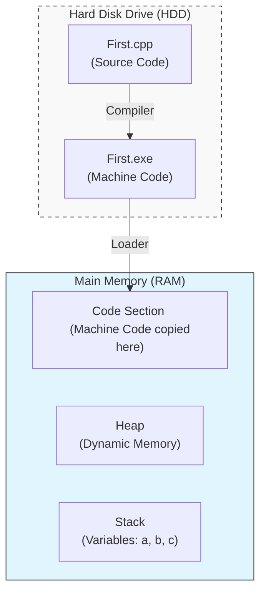

# Section 3: Program Development

## Programming Paradigm
*Evolution of how we write code:*

### 1. Monolithic Programming (Basic)
* **Structure:** Everything is in a single block.
* **Components:** Data and Instructions are mixed together.
* **Drawback:** Hard to manage for large programs.

### 2. Procedural / Modular (e.g., C Language)
* **Structure:** Program is divided into **functions**.
* **Flow:** `main()` calls `function1()`, `function2()`, etc.
* **Focus:** Action-oriented.

### 3. Object-Oriented (e.g., C++, Java)
* **Structure:** Program is divided into **Classes**.
* **Encapsulation:** Data and Functions are bundled together inside a class.
* **Flow:** Objects are created in `main()`, and functions are called on those objects.

---

## Flow Chart
**Definition:** A graphical representation of a program's logic.

### Standard Symbols
* **Oval:** Start / Stop
* **Parallelogram:** Input / Output (Read/Print)
* **Rectangle:** Process (Calculations, Assignments)
* **Diamond:** Condition (True/False decisions)
* **Arrows:** Flow direction

### Example: Sum of Two Numbers
*Based on your handwritten flowchart:*

```mermaid
flowchart TD
    Start([Start]) --> Input[/"Print 'Enter 2 nos' <br> Read a, b"/]
    Input --> Process[c = a + b]
    Process --> Output[/"Print 'sum is', c"/]
    Output --> Stop([Stop])
````

### Example: Conditional Logic

*Based on your `if a > b` sketch:*

```mermaid
flowchart TD
    Start([Start]) --> Read[/"Read a, b"/]
    Read --> Condition{"if a > b"}
    Condition -- True --> PrintA[/"Print a"/]
    Condition -- False --> PrintB[/"Print b"/]
    PrintA --> Stop([Stop])
    PrintB --> Stop
```

-----

## Program Development and Execution

**Steps to run a program:**

1.  **Editing:** Writing the code.
2.  **Compiling:** Translating source code to machine code.
3.  **Linking:** Connecting with Libraries (Header Files).
4.  **Loading:** Bringing the program from the Hard Disk (HDD) to Main Memory (RAM).
5.  **Execution:** CPU runs the instructions.

-----

## Main Memory Architecture

The Main Memory (RAM) is logically divided into 3 sections during execution:

1.  **Stack:** Stores all local variables and function calls.
2.  **Heap:** Used for dynamic memory allocation.
3.  **Code Section:** Stores the executable machine code.

### Memory Layout & Loading Process

*Visualizing how a program moves from HDD to RAM:*


