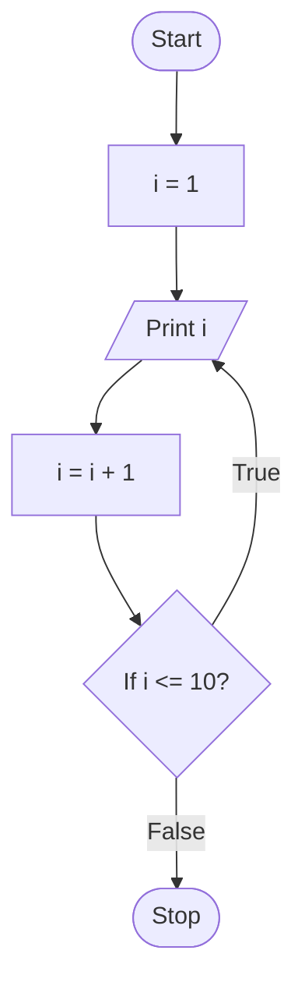
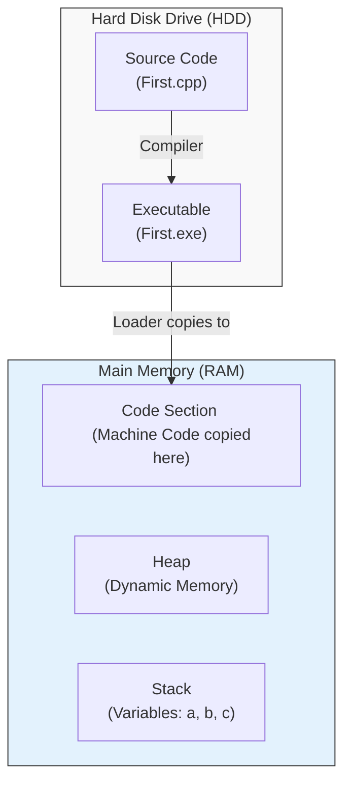

# Section 3: Program Development

## Programming Paradigm
*Evolution of coding styles:*

| Paradigm | Structure | Characteristics |
| :--- | :--- | :--- |
| **Monolithic** | Single block | • Data and instructions are mixed.<br>• Hard to manage for large programs. |
| **Procedural / Modular** | Divided into **Functions** | • Example: **C** Language.<br>• Action-oriented.<br>• `main()` calls `function1()`, `function2()`, etc. |
| **Object-Oriented** | Divided into **Classes** | • Example: **C++**, **Java**.<br>• **Encapsulation**: Data and functions are bundled together.<br>• `main()` creates Objects and calls functions on them. |

---

## Flow Chart
**Definition:** A graphical representation of logic.

### Standard Symbols
* **Oval:** Start / Stop
* **Parallelogram:** Input / Output (Read / Print)
* **Rectangle:** Process (Calculations)
* **Diamond:** Condition (Decision `Yes/No`)

### 1. Sequential Logic (Sum of 2 Numbers)
```mermaid
flowchart TD
    Start([Start]) --> Input[/"Print 'Enter 2 nos' <br> Read a, b"/]
    Input --> Process["c = a + b"]
    Process --> Output[/"Print 'sum is', c"/]
    Output --> Stop([Stop])
````

### 2\. Conditional Logic (Check if a \> b)

```mermaid
flowchart TD
    Start([Start]) --> Input[/"Read a, b"/]
    Input --> Condition{"If a > b?"}
    Condition -- True --> PrintA[/"Print a"/]
    Condition -- False --> PrintB[/"Print b"/]
    PrintA --> Stop([Stop])
    PrintB --> Stop
```

### 3\. Iterative Logic (Loop Example)



-----

## Steps for Program Development and Execution

1.  **Editing:** Writing the code.
2.  **Compiling:** Converting source code.
3.  **Linking:** Linking Libraries (Header Files).
4.  **Loading:** Bringing program from **Hard Disk** to **Main Memory**.
5.  **Execution:** Running the program.

-----

## Main Memory Architecture

When a program runs, the **Main Memory (RAM)** is logically divided into 3 sections:

1.  **Stack:** Stores all variables and data (static allocation).
2.  **Heap:** Used for **dynamic memory allocation**.
3.  **Code Section:** Stores the Machine Code.

### Visualizing Memory Loading

*How code moves from HDD to RAM:*


