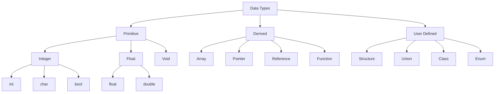

# Section 5: C++ Basics

## Basic Program Structure
A simple C++ program to take user input and display it.

```cpp
#include <iostream>
#include <string> // Required for string usage

using namespace std;

int main()
{
    string name;

    cout << "Enter your name: ";
    getline(cin, name);

    cout << "Hello " << name;

    return 0;
}
```

---

## Data Types
Data types define the type of data a variable can hold.

### Classification Hierarchy


### Primitives & Ranges
*Note: Sizes (bytes) can vary based on the compiler and system (16-bit vs 32-bit vs 64-bit).*

| Data Type | Size (Bytes) | Range (Typical) | Format Specifier / Note |
| :--- | :---: | :--- | :--- |
| **int** | 2 or 4 | $-32,768$ to $32,767$ (if 2 bytes) | Integer values |
| **float** | 4 | $1.5 \times 10^{-45}$ to $3.4 \times 10^{38}$ | Single precision |
| **double** | 8 | $5.0 \times 10^{-324}$ to $1.7 \times 10^{308}$ | Double precision |
| **char** | 1 | $-128$ to $127$ | Characters |
| **bool** | 1 | `true` (1) / `false` (0) | Boolean logic |

### ASCII Codes
Computers store characters as numbers (ASCII values).
* **A - Z**: $65 - 90$
* **a - z**: $97 - 122$
* **0 - 9**: $48 - 57$

---

## Modifiers
Modifiers alter the meaning of the base data type to fit various situations.

* **unsigned**: Holds only positive values.
    * `unsigned int`: Range $0$ to $65,535$
    * `unsigned char`: Range $0$ to $255$
* **long**: Increases the size/range.
    * `long int`: 4 or 8 bytes
    * `long double`: 12 or 16 bytes (extended precision)

### Variable Declaration Examples
```cpp
int x;              // Declaration
int rollno;         // Variable naming convention
char group = 'A';   // Initialization
float price = 29.5f;

// Valid declarations
int x1;
int _x;

// Invalid declarations
// int 1x; (Cannot start with digit)
// int for; (Cannot use keywords)
```

---

## Variables
**Definition:** Variables are the names given to data storage locations in memory.

---

## Operators

| Type | Symbol | Description |
| :--- | :---: | :--- |
| **Arithmetic** | `+`, `-`, `*`, `/`, `%` | Basic math and modulus (remainder) |
| **Relational** | `<`, `<=`, `>`, `>=` | Comparison |
| **Logical** | `&&`, `||`, `!` | Logical AND, OR, NOT |
| **Bitwise** | `&`, `|`, `^`, `~`, `<<`, `>>` | Bit-level manipulation |
| **Inc/Dec** | `++`, `--` | Increase or decrease value by 1 |
| **Assignment** | `=` | Assigns value from right to left |

---

## Operator Precedence
Determines which operator is performed first in an expression.

**Expression:** $x = a + b * c - d / e$

**Evaluation Order:**
1.  `*` and `/` have higher precedence than `+` and `-`.
2.  $b * c$ happens first.
3.  $d / e$ happens second.
4.  Then addition/subtraction happens from Left to Right.

**Precedence Table (Simplified):**

| Priority | Operator | Associativity |
| :---: | :---: | :--- |
| **1 (High)** | `( )` | Left to Right |
| **2** | `*`, `/`, `%` | Left to Right |
| **3** | `+`, `-` | Left to Right |
| **4 (Low)** | `=` | Right to Left |

---

## Compound Assignment
Shorthand for modifying a variable.

| Operator | Example | Equivalent To |
| :---: | :--- | :--- |
| `+=` | `sum += a` | `sum = sum + a` |
| `-=` | `sum -= b` | `sum = sum - b` |
| `*=` | `prod *= x` | `prod = prod * x` |
| `/=` | `quot /= y` | `quot = quot / y` |
| `%=` | `rem %= z` | `rem = rem % z` |
| `&=` | `bit &= 1` | `bit = bit & 1` |

---

## Increment & Decrement Operators
Used to increase (`++`) or decrease (`--`) a variable by 1.

### 1. Pre-Increment / Pre-Decrement
* **Syntax:** `++x` or `--x`
* **Action:** Change the value **first**, then use it.

```cpp
int x = 5;
int y = ++x; 
// x becomes 6 first
// then y becomes 6
```

### 2. Post-Increment / Post-Decrement
* **Syntax:** `x++` or `x--`
* **Action:** Use the value **first**, then change it.

```cpp
int x = 5;
int y = x++;
// y is assigned 5 (original value)
// x becomes 6 AFTER the assignment
```

---

## Bitwise Operators
Operations performed at the bit level (0 and 1).

**Truth Table:**

| A | B | A & B (AND) | A \| B (OR) | A ^ B (XOR) |
| :---: | :---: | :---: | :---: | :---: |
| 0 | 0 | 0 | 0 | 0 |
| 0 | 1 | 0 | 1 | 1 |
| 1 | 0 | 0 | 1 | 1 |
| 1 | 1 | 1 | 1 | 0 |

**Operators:**
* `&` (AND)
* `|` (OR)
* `^` (XOR)
* `~` (NOT / One's Complement)
* `<<` (Left Shift)
* `>>` (Right Shift)

---

## Enum (Enumeration)
If we want to define our own data type consisting of a set of named integer constants, we can use `enum`.

**Example 1: Days of Week**
```cpp
enum day {mon, tue, wed, thu, fri, sat, sun};
// By default: mon=0, tue=1, wed=2, etc.

int main() {
    day d;
    d = mon;
    // ...
}
```

**Example 2: Departments (Custom Values)**
```cpp
// You can assign specific values
enum dept {CS=1, ECE, IT, CIVIL}; 
// CS=1, ECE=2, IT=3, CIVIL=4 (auto-increment)

int main() {
    dept d;
    d = CS;
}
```

---

## Typedef
Used to create a new name (alias) for an existing data type. This helps with readability.

**Syntax:** `typedef <existing_type> <new_name>;`

**Example:**
```cpp
typedef int marks;
typedef int rollno;

int main() {
    // 'marks' is now treated as 'int'
    marks m1, m2, m3; 
    
    // 'rollno' is now treated as 'int'
    rollno r1, r2;
    
    return 0;
}
```
