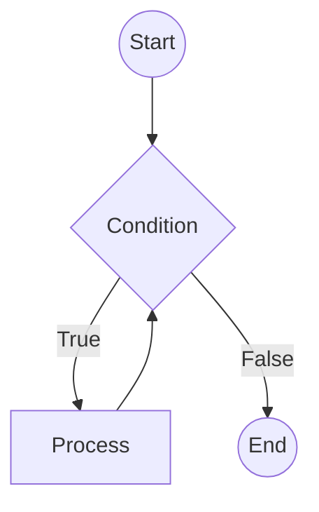
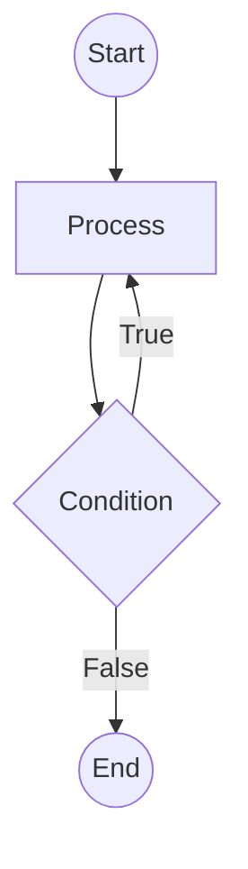

# Section 7: Loops

## Types of Loops
* While
* Do while
* For
* For each

---

## Loop Flowcharts

### 1. While Loop
*Entry Controlled Loop: Checks condition **before** execution.*



### 2. Do-While Loop
*Exit Controlled Loop: Executes body **at least once** before checking condition.*



---

## Code Implementations

### While Loop
```cpp
int i = 0;
while (i < 10)
{
    cout << "Hello\n";
    i++;
}
```

### Do-While Loop
```cpp
int i = 0;
do
{
    cout << "Hello\n";
    i++;
} while(i < 10);
```

### For Loop
```cpp
for(int i = 0; i < 10; i++)
{
    cout << i << " Hello\n";
}
```

---

## Key Notes
* **Counter-Controlled:** The `for` loop is considered a counter-controlled loop.
    * Usually, a `for` loop is written with a counter `i`.
    * Example: `for(int i=0; i<n; i++)` where `i` is the counter.
* **Infinite Loop:** A for loop can be written with empty parameters to create an infinite loop:
    * `for(;;)`
