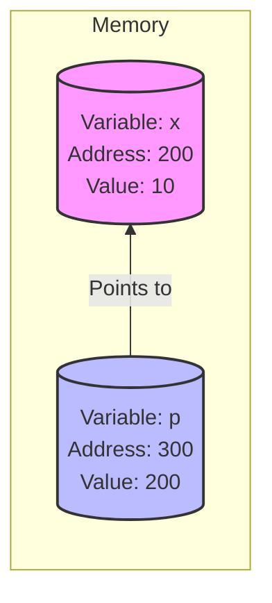
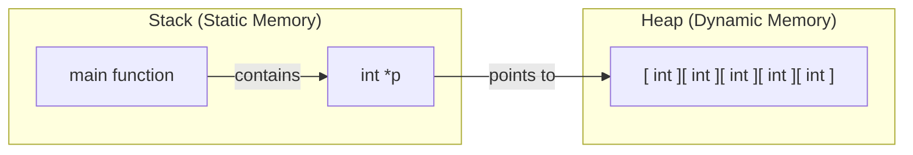
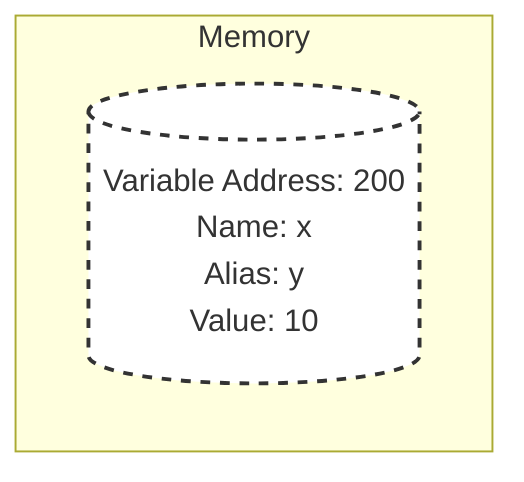

# Section 9 : Pointers

Pointers are a type of variable in C++. They are variables used for storing the address of data.

We have 2 types of variables:
* **Data variables:** Used for storing data.
    * Example: `int x = 10;`
* **Address variables:** Used for storing addresses.
    * Example: `int *p; p = &x;`

### Basic Syntax

```cpp
int x = 10;
int *p;      // Declaration
p = &x;      // Initialization
cout << *p;  // Dereferencing (Accessing the value at the address)
```

**Memory Visualization:**


---

## Why Pointers?

A program can only access the **Code section** and **Stack** directly. Pointers help it to access the **Heap section**. A pointer variable exists in the Stack, but the address it stores points to the Heap. Thus, it indirectly helps us access the Heap section.

**Main Uses:**

* To access Heap memory.
* To access files using file pointers.
* To access network connections.
* To access hardware devices (keyboard, mouse, printer, etc.).

> **Note:** In Java and C#, there are no pointers exposed to the programmer. Therefore, we cannot access devices directly through programs; we can only access them using the JVM or through the Common Language Runtime (CLR). Consequently, System Programming is generally not done in Java or C#.

---

## Heap Memory

* **Dynamic Memory:** Memory decided at run time, not compile time.
* Uses the `new` keyword; memory is created in the Heap.
* Heap memory does not delete automatically until the program is over or manually freed.

**Stack vs Heap Visualization:**



### Memory Leak

When we create memory using `new` and point to it with a pointer `p`, if we subsequently set `p` to `NULL` without freeing the memory, we lose access to that Heap memory. This is a **Memory Leak**. Therefore, we must free the memory first.

```cpp
delete []p; // Deallocate array
p = nullptr;   // Good practice
```

### Null Pointer

A pointer pointing to nothing (valid address 0).

* `p = NULL;` or `p = nullptr;`

---

## Pointer Arithmetic

Pointer arithmetic depends on the data type of the pointer.

* `int` is usually 4 bytes. If `p` is an integer pointer (`int *p`), `p++` moves the address forward by 4 bytes.
* `char` is 1 byte. If `p` is a char pointer, `p++` moves the address forward by 1 byte.

**Example Calculation:**

```cpp
int A[] = {2, 4, 6, 8, 10};
int *p = A;      // p points to A[0] (Value: 2)
int *q = &A[3];  // q points to A[3] (Value: 8)

// Operations
p++;             // Moves to next index
p--;             // Moves back
p = p + 2;       // Moves forward 2 indices
p = p - 2;       // Moves backward 2 indices
int d = q - p;   // Returns the distance (number of elements) between pointers
```

---

## Problems with Pointers

1. **Uninitialized Pointer:**
* Created a pointer `int *p;` and then assigned `*p = 25;` without `p` pointing to a valid address. This causes undefined behavior.


2. **Memory Leak:**
* Not deleting memory before setting the pointer to null.
* Note: `NULL` = `0`. `nullptr` is recommended in modern C++ as it is type-safe.


3. **Dangling Pointer:**
* A pointer pointing to a location that does not exist or has been deleted/deallocated.


**Dangling Pointer Example:**

```cpp
void main() {
    int *p = new int[5];
    // ... code ...
    delete []p; 
    // p is now a Dangling Pointer here
    cout << *p; // Error or garbage value
}
```

---

## References

```cpp
int x = 10;
int &y = x; // Reference declaration
```

* A Reference is nothing but an **alias/nickname** of a variable.
* References do **not** consume extra memory (conceptually, they share the memory of the original variable).
* **Rules:**
1. Declaration of a reference variable requires an initializer immediately.
* `int &y = x;` (Correct)
* `int &y;` (Error: not possible)


2. We cannot change the reference to refer to another variable later.
* If `int &y = x;` is done, `y` is locked to `x`.
* Writing `y = a;` will assign the **value** of `a` to `x` (via `y`), it will not make `y` reference `a`.


**Reference Visualization:**



---

## Additional Examples & Notes

### 1. Pointer Size

* The size of a pointer variable is generally independent of its data type.
* `int *p1`, `float *p2`, `char *p3` — all take **8 bytes** in modern 64-bit compilers (or 4 bytes in 32-bit).

### 2. Negative Indexing

```cpp
int A[] = {2, 4, 6, 8, 10, 12};
int *p = &A[3];   // p points to index 3 (Value 8)

cout << p[-2];    
// p[-2] means go 2 integers backward from current p.
// Current: Index 3. Back 2: Index 1.
// A[1] is 4. Result: 4.
```

### 3. Reference Logic

```cpp
int x = 10;
int &y = x;   // y is alias of x
y = x + y;    // y = 10 + 10 = 20.
cout << x;    // Since y changed to 20, x is also 20.
```

### 4. Reference to a Pointer

```cpp
int x = 10;
int *y = &x;  // y is a pointer to x
int *&z = y;  // z is a reference to the pointer y

// Now, 'y' and 'z' are two names for the SAME pointer variable.
// Changing where z points will change where y points.
```
