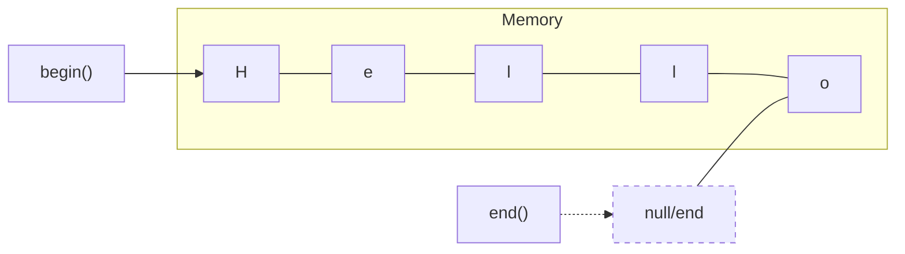

# Section 10: Strings

There are two main ways to handle strings in C++:
1.  **Using `char` Array** (Available in both C and C++)
2.  **`class string`** (Only in C++)

---

## 1. Using Char Array

### Key Concepts
* **Storage:** Literals are created in the code section.
    * If you want a string in the **Heap**: Use a `char` pointer (`char*`).
    * If you want a string in the **Stack**: Use a `char` array (`char[]`).
* **Quotes:**
    * Single quotes `' '` = `char`
    * Double quotes `" "` = `string`
* **Termination:** Strings must end with a Null character `'\0'` (numeric value 0).

> **Warning (ISO C++11):** Conversion from string literal to `char*` is not allowed.
> ```cpp
> char *S = "Hello"; // Deprecated/Warning in modern C++
> const char *S = "Hello"; // Correct way for literals
> ```

### Reading Input
```cpp
char name[20];
cin >> name;    // Reads only the first word (stops at space)
```

**To read sentences (handling spaces):**

* `cin.get(name, 20);`
* *Note:* `get` leaves the 'Enter' key (newline) in the buffer. The next string input will read that empty line.
* **Fix:** Use `cin.ignore();` after using `cin.get()`.


* `cin.getline(name, 20);`
* **Recommendation:** Use this for multiple lines as it handles the newline character automatically.


### Built-in Functions (`<cstring>` / `string.h`)

| Function | Usage | Description |
| --- | --- | --- |
| `strlen(s)` | `int len = strlen(s);` | Returns string length. |
| `strcat(dest, src)` | `strcat(s1, s2);` | Concatenates `src` to `dest`. `dest` becomes `dest + src`. |
| `strncat(dest, src, n)` | `strncat(s1, s2, 3);` | Concatenates only `n` letters of `src` to `dest`. |
| `strcpy(dest, src)` | `strcpy(s1, s2);` | Copies `src` string into `dest`. |
| `strncpy(dest, src, n)` | `strncpy(s1, s2, 5);` | Copies only `n` characters. |
| `strstr(main, sub)` | `if(strstr(s1, s2) != NULL)` | Finds a substring. Returns pointer to occurrence or `NULL`. |
| `strchr(main, char)` | `strchr(s1, 'a');` | Finds first occurrence of a character. |
| `strcmp(s1, s2)` | `int res = strcmp(s1, s2);` | Compares 2 strings. Returns: `-ve` (s1 < s2), `0` (equal), `+ve` (s1 > s2). |
| `strtol(s1, NULL, 10)` | `long n = strtol(s, NULL, 10);` | String to Long Int (10 is the base/decimal). |
| `strtof(s1, NULL)` | `float f = strtof(s, NULL);` | String to Float. |
| `strtok(s1, "=;")` | `char* token = strtok(s, "=;");` | Tokenizes string using delimiters (e.g., `=` or `;`). |

---

## 2. Class String (`std::string`)

Requires: `#include <string>`

### Input

```cpp
string str;
cin >> str;           // Reads only one word
getline(cin, str);    // Reads a full sentence
```

### String Class Functions

**Capacity & Size:**

* `s.length()` or `s.size()`: Returns length.
* `s.capacity()`: Returns current allocated storage.
* `s.resize(30)`: Resizes the string (pads or truncates).
* `s.max_size()`: Maximum size string can reach.
* `s.clear()`: Clears the contents.
* `s.empty()`: Returns boolean (true if empty).

**Modification:**

* `s.append("Bye")`: Adds to end.
* `s.insert(3, "kk")`: Inserts "kk" at index 3.
* `s.insert(3, "Apple", 2)`: Inserts first 2 chars of "Apple" at index 3.


* `s.replace(3, 5, "aa")`: Starting at index 3, replace next 5 chars with "aa".
* `s.erase()`: Same as `clear()`.
* `s.push_back('z')`: Insert char at end.
* `s.pop_back()`: Delete last char.
* `s1.swap(s2)`: Swaps the contents of two strings.

**Search & Copy:**

* `s.copy(char des[])`: Copy string to a char array.
* `s.find(str)` or `s.find(char)`: Returns index of first occurrence.
* `s.rfind(str)`: Search from the **right** (end).
* *Note:* If not found, returns `string::npos` (which is effectively -1/largest unsigned int).


* `s.find_first_of('a', 3)`: Find 'a' starting search from index 3.
* `s.find_last_of('le')`: Search from right side; returns index of *any* of the characters found first.
* `s.substr(start, number)`: Extract a portion of the string.
* `s.compare(str)`: Dictionary comparison (returns -ve, 0, +ve).

### Operators

* `at(index)`
* `front()`: First character.
* `back()`: Last character.
* `[]`: Overloaded array operator (access via index).
* `+`: Concatenation.

---

## 3. String Class - Iterators

Iterators act like pointers to characters within the string (can read and modify).

* `begin()`: Points to first char.
* `end()`: Points to position *after* last char.
* `rbegin()`: Reverse iterator start.
* `rend()`: Reverse iterator end.

### Iterator Diagram



### Examples

**1. Basic Iterator (Modify string)**
```cpp
string str = "today";
string::iterator it;

for(it = str.begin(); it != str.end(); it++) {
    // cout << *it;
    *it = *it - 32; // Convert to Uppercase
}
cout << str; // Output: TODAY
```

**2. Reverse Iterator**
```cpp
string str = "today";
string::reverse_iterator it;

for(it = str.rbegin(); it != str.rend(); it++) {
    cout << *it;
}
// Output: yadot
```

**3. Standard Loop (Equivalent logic)**
```cpp
string str = "today";
for (int i = 0; str[i] != '\0'; i++) {
    // cout << str[i];
    str[i] = str[i] - 32;
}
cout << str; // Output: TODAY
```

**4. Create String of Specific Length**
```cpp
string str = "";
str.resize(len);
```
