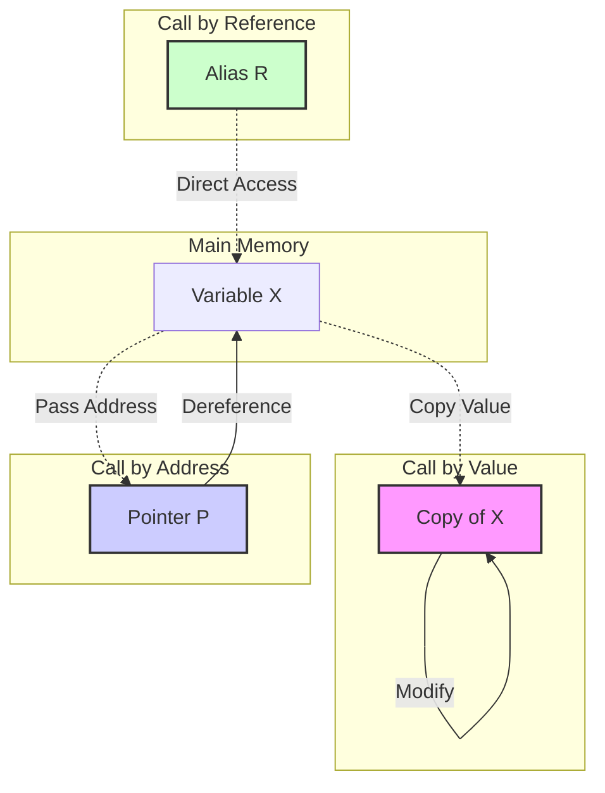

# Section 11: Functions

## Introduction to Functions
* **Definition**: A function is a piece of a program that performs a specific task.
* **Input/Output**: It may take inputs (parameters/arguments) and return a result (return value).
* **Purpose**: Functions are fundamental to procedural or modular programming.
* **Reusability**: They can be reused within the same program or across different programs multiple times.

> **Best Practice**: Avoid user interaction (`cin` and `cout`) inside general-purpose functions. Ideally, handle I/O in the `main` function.

---

## Function Overloading
* **Definition**: Functions having the **same name** but a **different argument list**.
* **Return Type**: The return type is **never considered** in function overloading. Functions differing *only* by return type cannot be overloaded.
* **Conflict**: If the function name and parameter list are exactly the same, but the return type is different, it is a **name conflict** (redefinition), not overloading.

**Example Logic**:
$$f(x, y) \rightarrow \text{int}$$
$$f(x, y) \rightarrow \text{float}$$
*This is invalid overloading.*

---

## Function Templates
* **Concept**: Functions that are generic and generalized.
* **Syntax**: `template <typename T>`
* **Usage**: Instead of writing different functions for every data type, use a template `T` to handle various types dynamically.

---

## Default Arguments
* **Rule**: When defining default arguments, start from the **rightmost** parameter and move left without skipping any.
    * *Correct*: `void fun(int a, int b = 0, int c = 0)`
    * *Incorrect*: `void fun(int a = 0, int b, int c = 0)`

---

## Parameter Passing Methods
*(Pass by is also known as Call by)*

### 1. Call by Value
* **Mechanism**: Values of actual parameters are copied to formal parameters.
* **Memory**: Separate memory space is allocated for the formal parameters.
* **Modification**: Changes in the function do not affect the original variables.

### 2. Call by Address
* **Mechanism**: The **addresses** of the variables are passed to pointers in the function.
* **Modification**: The function can modify the original variables using dereferencing.

### 3. Call by Reference (C++ Only)
* **Mechanism**: References are essentially "nicknames" or aliases for a variable.
* **Syntax**: Uses `&` in the function definition (e.g., `void fun(int &x)`).
* **Behavior**:
    * It works similarly to *Call by Address* regarding data modification (it modifies actual parameters).
    * **Inline Expansion**: Often, call by reference does not generate a separate piece of machine code (stack frame). Instead, the compiler may copy the function's machine code to the place of the function call.
    * Because of this code copying, these functions behave like **Inline Functions** in C++.
* **Limitations**:
    * Avoid complex code (like loops) inside functions passed by reference.
    * If complex code exists, the compiler may automatically revert it to **Call by Address** logic, meaning it won't be inline anymore.

#### Comparison Diagram

---

## Return Methods

### Return by Address

* A function can return a pointer (address of a variable).

### Return by Reference

* **Usage**: While functions usually act as **R-values** (appearing on the right side of an assignment), returning by reference allows a function to act as an **L-value** (appearing on the left side).
* *Example*: `fun(x) = 25;` (Only possible if `fun` returns by reference).

---

## Variable Scope & Storage Classes

### Global vs Local Variables

| Feature | Local Variable | Global Variable |
| --- | --- | --- |
| **Location** | Inside a function | Outside all functions |
| **Scope** | Accessible only within the function | Accessible in all functions |
| **Memory** | Stack (usually) | Fixed data segment |
| **Lifespan** | Function execution time | Program execution time |

> **Note**: Global variables reside in a specific memory section, often initialized to zero by default.

### Scoping Rules

* C++ follows **Block Level Scope**. Variables declared inside a block `{ }` are only accessible within that block.

### Static Variables

* **Comparison**:
* **Global Variables**: Accessible everywhere, remain in memory throughout program life.
* **Static Variables**: Remain in memory throughout program life (like Global), but **accessible only** within the function they are declared in (like Local).

* **Analogy**: Think of them as global variables hidden inside a function.
* **Availability**: Static variables are available in C++ but not in Java (in the context of local function variables).

---

## Recursive Functions

* **Definition**: A function calling itself.
* **Tracing Example**:
* Printing before the recursive call (Head Recursion) -> Output: `5 4 3 2 1`
* Printing after the recursive call (Tail Recursion) -> Output: `1 2 3 4 5`

---

## Function Pointers

* **Declaration**: The pointer name must be enclosed in brackets, otherwise, the compiler treats it as a function returning a pointer.
* *Syntax*: `void (*fp)();`

* **Initialization**: `fp = functionName;`
* **Call**: `(*fp)();`

### Polymorphism via Function Pointers

* **Concept**: A single function pointer can point to any function with the same signature.
* **Runtime Polymorphism**: This mechanism allows calling different functions at runtime based on what the pointer holds, achieving a form of polymorphism (similar to function overriding).

---

## Key Notes

* If a function returns no value, its type is **void**.
* **Call by Value** passes copies; actual parameters strictly cannot be modified.
* **Templates** allow functions to accept data types as parameters.
