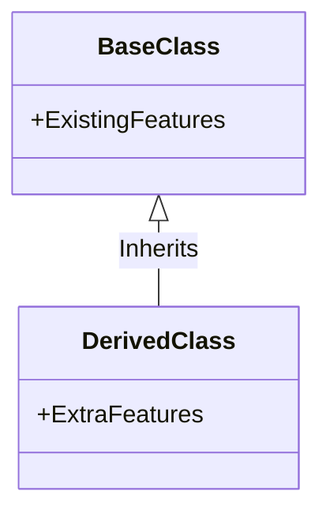
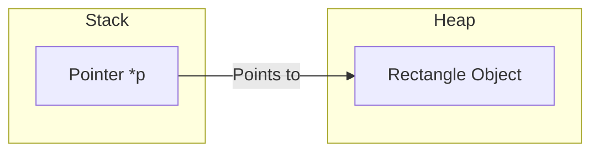

# Section 12: Introduction to OOPS

## Principles of Object Orientation
* Abstraction
* Encapsulation/Data Hiding
* Inheritance
* Polymorphism

---

### Abstraction
* When we don't know the internal details, that is nothing but abstraction.
* We just need names of functions; we don't see the implementation of functions as well as data (data is hidden).
* We only know function details when we are writing them, not when we are using them.
* **Example:** Without knowing how the `printf` is working we have used it many times, so that is abstraction for us.
* Classes help us achieve abstraction.

### Encapsulation
* We hide the data and make the functions visible, and we put things together at one place.
* Data and functions are together; a **Class** helps keep the data and the functions together. That is encapsulation.
* Along with this, in classes, we make data as **private**. This is not for security; it's for avoiding mishandling.
* We make it private and functions public. We hide the data and show functions.
* **Data hiding** comes as a part of encapsulation.

> Just like Abstraction and Encapsulation are interrelated, Inheritance and Polymorphism are also interrelated.

### Inheritance
* Suppose I want another class in which I want all these features plus extra features. I should be able to inherit, borrow all these features from an existing class. This is inheritance.



### Polymorphism

* We can define polymorphism as the ability of a message to be displayed in more than one form.
* A real-life example: A person at the same time can have different characteristics. Like a man at the same time is a father, a husband, an employee.


* **Example:** If we want to learn driving, we will learn to drive a "car", not specifically a BMW or Suzuki or Toyota. If we learn one, we can drive all cars.
* The way it runs is different, the way it drives is different. That's polymorphism.
* With the help of inheritance, we achieve polymorphism.

---

## Class

* Class is basically a classification. Students, employees, cars, etc., are all classifications or a class.
* Classification is based on some criteria/property or the common things that we find in them.
* **Class** is a definition/blueprint/design and **Object** is an instance.
* Our class will contain data and functions.
* Data is called as **property**.
* Function is called as **behavior**.


* Defining a class is different from creating its object and using it.
* Classes are used for defining user-defined data types so that we can declare the variables of that class type.
* Functions will not occupy any memory space; only data members occupy memory.
* Whatever we write inside the class, by default, it becomes **private**.
* Dot operator (`.`) is used for accessing members of an object.

**Class Example:**

```cpp
class Rectangle {
    public:
        int length;
        int breadth;

        int area() {
            return length * breadth;
        }

        int perimeter() {
            return 2 * (length + breadth);
        }
};

int main() {
    Rectangle r1;
    r1.length = 10;
    r1.breadth = 5;
    cout << r1.area(); // Output: 50
}
```

---

## Pointer to an Object in Heap

* We are using a pointer in the example below, but memory is still in stack, not in heap.
* **Dot operator (`.`)**: Used for accessing the members of an object using a variable name.
* **Arrow operator (`->`)**: Used for accessing the members of an object using a pointer on an object.
* The arrow (`->`) is a de-referencing operator; instead of using `*` (star), we can use this.
* Every pointer takes either 2 or 4 bytes depending on the compiler.

**How to create an object in Heap:**

* There is no name for the object, but a pointer is pointing onto that one.
* **Stack Object:** `Rectangle r;`
* **Heap Object:** `Rectangle *p = new Rectangle();`
* *Note:* In Java, we cannot create an object in the stack; objects are always created in a heap using `new`. But C++ gives us an option whether we want it in the stack or the heap.



**Code Example:**

```cpp
Rectangle r; // Created in Stack

Rectangle *p;
p = new Rectangle; // Created in Heap

p->length = 15;
p->breadth = 10;
cout << p->area(); // Accessing using arrow operator
```

---

## Data Hiding

* Only the functions should be made **public**; data members should be made **private**.
* If data is made public, there are chances it may be mishandled. If mishandling is done, the functions of a class may not give right results, and we cannot rely on such classes.
* As now data members are private, we can't read or change their values directly. So we make functions to do so: **Getters (Accessor)** and **Setters (Mutator)**.

**Code Example:**

```cpp
class Rectangle {
private:
    int length;
    int breadth;

public:
    // Mutator (Setter)
    void setLength(int l) {
        if(l >= 0)
            length = l;
        else
            length = 0; 
    }
    // Accessor (Getter)
    int getLength() {
        return length;
    }
};
```

---

## Constructor

* It's philosophically wrong when we create a rectangle object and its length and breadth are garbage/undefined (and we set them later).
* While creating or buying any rectangle object, we also tell what should be its length and breadth.
* So we want the length and breadth to be set at the time of construction of that object.
* A constructor is a function which will be automatically called when the object is constructed.

### What is a Constructor?

* A constructor is a function which will have the **same name as the class name**.
* The constructor will not have any return type.

### Different types of Constructors:

1. **Default Constructor**: (Built-in/Compiler provided). If we don't write any, the compiler provides one. It is called automatically when we create an object.
2. **Non-Parameterized Constructor**: (User-defined default).
3. **Parameterized Constructor**.
4. **Copy Constructor**.

**Constructor Examples:**

```cpp
class Rectangle {
private:
    int length;
    int breadth;

public:
    // Non-Parameterized Constructor
    Rectangle() {
        length = 0;
        breadth = 0;
    }

    // Parameterized Constructor
    Rectangle(int l, int b) {
        setLength(l);
        setBreadth(b);
    }

    // Copy Constructor
    Rectangle(Rectangle &r) {
        length = r.length;
        breadth = r.breadth;
    }
};
```

### Problem with Copy Constructor (Shallow Copy)

* The problem with the copy constructor is if there is a direct memory allocation done by an object, then the copy constructor may not create a new memory for it; it will point on the same memory.
* We have to be careful with this type of thing.

### Deep Copy Constructor

* We need to copy everything.
* Our copy constructor should create new memory and point to it, instead of just pointing to the memory of the object that passed.

---

## Types of Functions in a Class

* **Constructor** (Non-Parameterized, Parameterized, Copy)
* **Mutators** (`setLength`, `setBreadth`)
* **Accessors** (`getLength`, `getBreadth`)
* **Facilitators** (`area`, `perimeter`)
* **Inspector Function** (Enquiry - e.g., `isSquare()`. returns boolean or int).
* **Destructor**

---

## Scope Resolution Operator (`::`)

* We don't always elaborate functions inside the class. We just write the header/prototype inside, and the functions are elaborated outside the class using the **Scope Resolution Operator**.
* This shows that the scope of this function is within the class specified.
* **Mechanism:**
* If we write the function **outside**, the machine code for that function is separately generated. Calls go to that function and return.
* If we write the function **inside** the class, the machine code is replaced at the place of the function call (Inline).


* In C++, it is good practice to write the function outside using scope resolution unless logic is simple.

**Code Example:**

```cpp
class Rectangle {
    // ... data members ...
public:
    int area(); // Prototype only
};

// Definition outside class
int Rectangle::area() {
    return length * breadth;
}
```

---

## Inline Functions

* The functions which expand in the same line where they are called.
* There is no separate block for that function in machine code; it is pasted/copied at the place of call.
* **Automatic:** If we define a function *inside* a class, it is automatically inline.
* **Manual:** If we write a function *outside*, we can make it inline by adding the `inline` keyword.

---

## This Pointer

* How do you refer to the data members of the same class or the same object to avoid name ambiguity?
* We use `this->`.
* `this` is a pointer to the current object.

**Code Example:**

```cpp
Rectangle(int length, int breadth) {
    this->length = length;   // this->length refers to data member
    this->breadth = breadth; // breadth refers to parameter
}
```

---

## Structure vs Class

* In C language, structures can only have data members.
* In C++, structures can have data members as well as functions (similar to a class).

| Feature | Class | Structure (`struct`) |
| --- | --- | --- |
| **Default Access** | Private | Public |
| **Usage** | Used for Data Hiding & OOP | Used for grouping public data |

**Code Example:**

```cpp
struct Demo {
    int x;
    int y;
    
    void display() {
        cout << x << " " << y;
    }
}; // By default x, y and display are public
```
