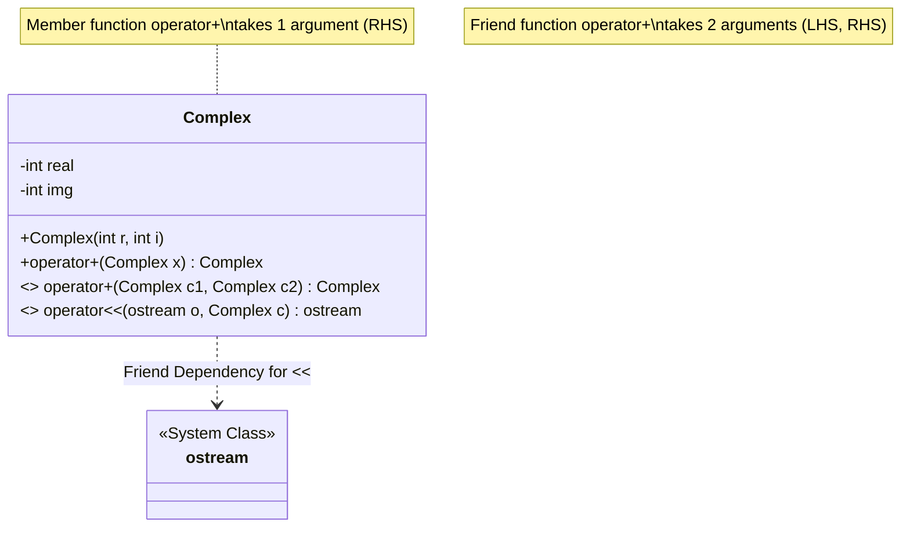

# Section 13: Operator Overloading

## Operator Overloading
For our own user-defined data types (classes), we can overload operators. There are various operators that can be overloaded in C++ (e.g., `+`, `*`, `-`, `()`, `++`, `new`, `delete`, etc.), with a few exceptions.

**Key Concept:**
By changing the name of a function from something like `add` to `operator+`, we enable the syntax `c3 = c1 + c2` instead of `c3 = c1.add(c2)`.


### Example 1: Standard Function vs. Operator Overloading

**Using a standard `add` function:**
```cpp
class Complex {
private:
    int real;
    int img;
public:
    Complex(int r = 0, int i = 0) {
        real = r;
        img = i;
    }

    // Normal member function
    Complex add(Complex x) {
        Complex temp;
        temp.real = real + x.real;
        temp.img = img + x.img;
        return temp;
    }
};

int main() {
    Complex C1(3, 7);
    Complex C2(5, 4);
    Complex C3;
    
    // Explicit function call
    C3 = C1.add(C2); 
}
```

**Using Operator Overloading:**

```cpp
class Complex {
    // ... (private members and constructor same as above) ...
public:
    // Overloaded operator function
    Complex operator+(Complex x) {
        Complex temp;
        temp.real = real + x.real;
        temp.img = img + x.img;
        return temp;
    }
};

int main() {
    Complex C1(3, 7);
    Complex C2(5, 4);
    Complex C3;
    
    // Syntactic sugar enabled by overloading
    C3 = C1 + C2; 
    // This is internally equivalent to: C3 = C1.operator+(C2);
}
```

---

## Friend Operator Overloading

There is another method for overloading an operator: using a **friend function**.

* We declare the friend function inside the class.
* Example: `friend Complex operator+(Complex c1, Complex c2);`


* It does not belong to the class but is a "friend" of the class. Therefore, we do not use the scope resolution operator (`::`) when defining it.
* The function is implemented *outside* the class.

### Example 2: Operator Overloading using Friend Function

```cpp
class Complex {
private:
    int real;
    int img;
public:
    Complex(int r=0, int i=0) { real = r; img = i; }
    
    // Declaration inside the class
    friend Complex operator+(Complex c1, Complex c2);
};

// Definition outside the class (No Complex:: scope resolution)
Complex operator+(Complex c1, Complex c2) {
    Complex t;
    t.real = c1.real + c2.real;
    t.img = c1.img + c2.img;
    return t;
}

int main() {
    Complex c1, c2, c3;
    // Calling the friend function
    c3 = c1 + c2; 
    // This is equivalent to: c3 = operator+(c1, c2);
}
```

> **Note:** Some operators can be overloaded as member functions as well as friend functions.
> * Member function syntax: `c3 = c1.operator+(c2)`
> * Friend function syntax: `c3 = operator+(c1, c2)`
> 
> 

---

## Insertion Operator Overloading

This refers to overloading the output stream operator (`<<`), also known as the insertion operator.

* We use `cout` and `cin` for displaying values and reading data. These use the insertion (`<<`) and extraction (`>>`) operators, which we can overload for our custom classes.
* **Why Friend?**
* Syntax: `ostream& operator<<(ostream &o, Complex &c)`
* The operator function takes 2 parameters from two *different* types of objects (`ostream` and `Complex`).
* Because the left operand (`cout`) is an object of the `ostream` class (not our `Complex` class), this function cannot be a member of the `Complex` class. It must be a **friend**.


### Example 3: Overloading Insertion (`<<`)

```cpp
#include <iostream>
using namespace std;

class Complex {
private:
    int real;
    int img;
public:
    Complex(int r=0, int i=0) { real = r; img = i; }

    // Friend declaration
    friend ostream& operator<<(ostream &o, Complex &c1);
};

// Definition
ostream& operator<<(ostream &o, Complex &c1) {
    o << c1.real << "+i" << c1.img;
    return o; // Returns ostream object to allow chaining (cout << c1 << c2)
}

int main() {
    Complex c1(10, 5);
    // Usage
    cout << c1; // Output: 10+i5
    
    // Internally: operator<<(cout, c1);
    return 0;
}
```

### Summary Points

* Insertion (`<<`) and extraction (`>>`) operators are overloaded by implementing **friend functions**.
* Operators can be overloaded using **Friend** or **Member** functions.
* Assignment (`=`) and Type cast operators can also be overloaded.
* **Restriction:** The Scope Resolution Operator (`::`) **cannot** be overloaded.

---

### Structural Overview (Mermaid Diagram)


