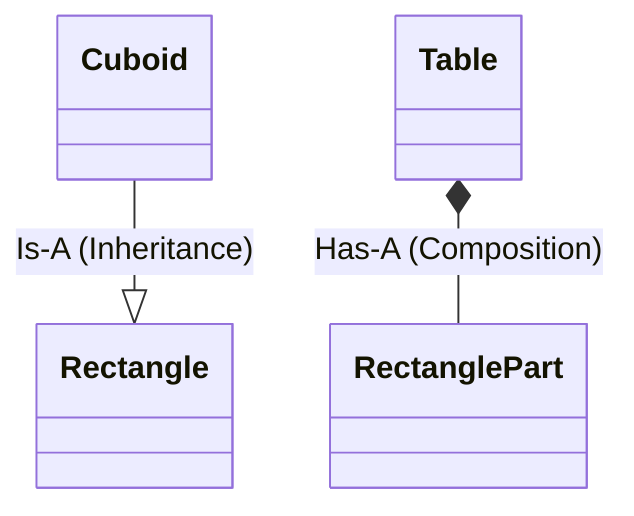
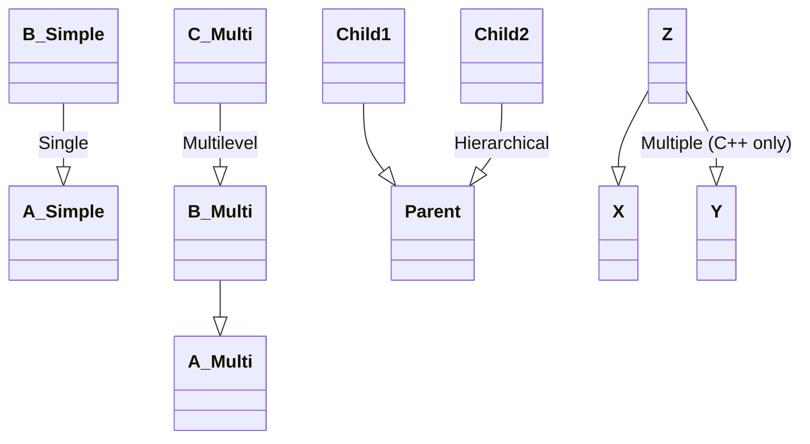
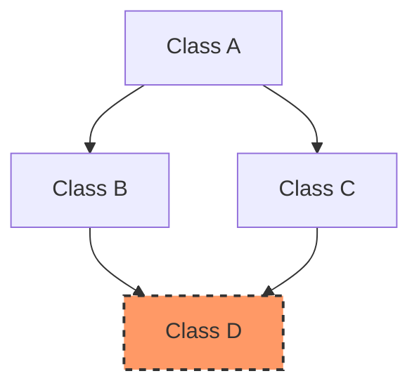
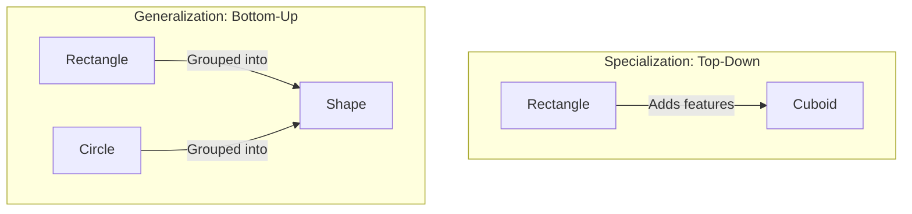

# Section 14: Inheritance

## Inheritance Definition
* **Acquiring the features of an existing class into a new class**, that is deriving a class from an existing class.
* It is the procedure of borrowing the features of an existing class into a new class.
* **Syntax:**
    ```cpp
    class Base {
        // Base class members
    };

    class Derived : public Base {
        // Derived class members
    };
    ```
* **Note:** The private members of the base class are not accessible inside the derived class directly; we need to use setters and getters.

---

## Constructors in Inheritance

When we create an object of a derived class:
1.  The **default constructor of the Base class** is executed first.
2.  Then, the **Derived class constructor** is executed.

* **Logic:** The constructors are called from Derived to Base, but the **execution** order is from Base to Derived.

### Example
```cpp
class Base {
public:
    Base() { cout << "Base Created" << endl; }
};

class Derived : public Base {
public:
    Derived() { cout << "Derived Created" << endl; }
};

int main() {
    Derived d; 
    // Output:
    // Base Created
    // Derived Created
}
```

### Parametrized Constructors

By default, the non-parameterized (default) constructor of the Base class is called. If we want to call a **parameterized constructor** of the Base class, we must explicitly call it from the Derived class's initializer list.

**Syntax:**

```cpp
class Derived : public Base {
public:
    Derived(int a, int b) : Base(a) { // Passing 'a' to Base constructor
        // Use 'b' here
    }
};
```

---

## Is-A vs Has-A Relationship

### Is-A Relationship (Inheritance)

* **Example:** A `Cuboid` inherits from `Rectangle`. A Cuboid **is a** Rectangle (with added depth).
* **Mechanism:** Achieved via Inheritance (`: public Base`).

### Has-A Relationship (Composition/Aggregation)

* **Example:** A `Table` class has a member object of type `Rectangle` (representing the table top). A Table **has a** Rectangle.
* **Mechanism:** Achieved by creating an object of one class inside another.

**Visual Representation:**



**Summary of Usage:**

1. **Inherit:** Derive a child class (Is-A).
2. **Object:** Create an object within a class (Has-A).

---

## Access Specifiers

A class can have three types of members:

1. **Public**
2. **Private**
3. **Protected**

### Accessibility Matrix

| Access Specifier | Accessible Inside Same Class? | Accessible in Derived Class? | Accessible on Object (Main)? |
| --- | --- | --- | --- |
| **Private** | Yes | No | No |
| **Protected** | Yes | Yes | No |
| **Public** | Yes | Yes | Yes |

* **Philosophy:**
* **Private:** Strictly internal.
* **Protected:** Family secrets (accessible to children, but not outsiders).
* **Public:** Open to everyone.


---

## Types of Inheritance

There are several ways classes can inherit from one another.



1. **Single Inheritance:** A derived from B.
2. **Hierarchical Inheritance:** Multiple classes derived from one base.
3. **Multilevel Inheritance:** A derives B, B derives C.
4. **Multiple Inheritance:** A class inherits from more than one class (e.g., C derives from A and B). *Note: Not possible in Java.*
5. **Hybrid Inheritance:** A combination of the above (e.g., mixing Hierarchical and Multiple).

---

## Multipath Inheritance & Virtual Base Classes

### The Diamond Problem (Multipath Inheritance)

If a class `D` derives from `B` and `C`, and both `B` and `C` derive from `A`, then `D` inherits two copies of `A`.

* If there is a function in class `A`, it is available in class `D` via two paths (Path B and Path C).
* This causes **ambiguity**.



### Solution: Virtual Base Classes

* **Virtual Base Classes** are used to remove the ambiguity.
* By declaring the inheritance as `virtual`, only one copy of the base class (`A`) is maintained.

**Syntax:**

```cpp
class B : virtual public A { ... };
class C : virtual public A { ... };
class D : public B, public C { ... };
```

---

## Ways of Inheritance (Public, Protected, Private)

There are three modes to derive a class. The mode determines the visibility of the base class members in the derived class.

* **Public Inheritance:** `class Child : public Parent`
* **Protected Inheritance:** `class Child : protected Parent`
* **Private Inheritance:** `class Child : private Parent` (Default if not specified)

### Effect on Members in Derived Class

| Base Class Member | Inherited as **Public** | Inherited as **Protected** | Inherited as **Private** |
| --- | --- | --- | --- |
| **Public** | Public | Protected | Private |
| **Protected** | Protected | Protected | Private |
| **Private** | *Not Accessible* | *Not Accessible* | *Not Accessible* |

* **Note:** In C++, we can restrict access down the hierarchy. This flexibility is generally not available in other languages like Java (which only supports public inheritance logic).

---

## Generalization vs Specialization

### Specialization (Top-Down)

* Something already exists (Base), and we derive a new class to add specific features.
* **Example:** `Rectangle` exists -> derive `Cuboid` (adds height).
* **Purpose:** To share existing features with a child class.
* **Direction:** Top-Down approach.

### Generalization (Bottom-Up)

* We have specific classes (e.g., `Rectangle`, `Circle`) and we group them under a common logical term (e.g., `Shape`).
* `Shape` is a general term; it doesn't physically exist (abstract).
* **Example:** Innova, Swift, Ferrari -> generalized as `Car`.
* **Purpose:** To group classes together and achieve **Polymorphism**.
* **Direction:** Bottom-Up approach.



### Summary of Purposes

1. **Inheritance for Specialization:** Share code/features.
2. **Inheritance for Generalization:** Achieve Polymorphism.

---

*Note: Constructors can be declared as private, which restricts object creation (Singleton Pattern).*
