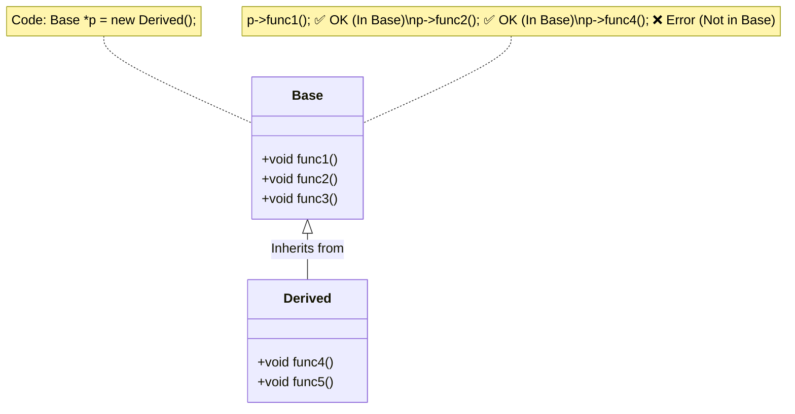

# Section 15: Base Class Pointer Derived Class Object

### 1. Concept: Base Pointer to Derived Object
We can have a **Base Class Pointer** pointing to a **Derived Class Object**.

* **Rule:** When a base class pointer holds a derived class object, we can **only call functions present in the base class**.
* **Restriction:** We **cannot** call functions that are defined exclusively in the derived class.
* **Reasoning:** The pointer is of type `Base`. The compiler determines accessible members based on the pointer type, not the object type at runtime (unless virtual functions are used, though that is a separate topic).

#### Visual Representation
The following diagram illustrates the accessibility of functions based on your notes:



---

### 2. Inverse Case: Derived Pointer to Base Object

What if the pointer is of the **Derived** class and we try to assign an object of the **Base** class?

* **Result:** It is **NOT possible**.
* **Reason:** A `Derived` pointer expects to see all the features of the Derived class. A `Base` object does not have the extra features (like `func4` or `func5`), so assigning it would lead to undefined behavior when accessing those missing members.

```cpp
Derived *p;
p = new Base(); // ❌ Error: Cannot assign Base object to Derived pointer
```

---

### 3. Real World Analogy: The Car

Think of a **Basic Car** and an **Advanced Car** (where Advanced Car inherits from Basic Car).

* **Inheritance:** The Advanced Car has all the features of a Basic Car, plus extra features.
* **Logic:**
* You **can** call an Advanced Car a "Basic Car" (because it has all basic features).
* You **cannot** call a Basic Car an "Advanced Car" (because it lacks the advanced features).


* **In Code:** The methods of the Advanced Car are not present in the Basic Car. Therefore, a pointer to a "Basic Car" cannot access the exclusive methods of the "Advanced Car," even if it is actually looking at one.

---

### 4. Code Example

```cpp
class Base {
public:
    void func1() { }
    void func2() { }
};

class Derived : public Base {
public:
    void func4() { }
    void func5() { }
};

int main() {
    Derived d;
    
    // Base pointer pointing to Derived object
    // This is valid because Derived IS A Base
    Base *ptr = &d;      // Stack allocation example
    // Or: Base *ptr = new Derived(); // Heap allocation example

    // Function Calls
    ptr->func1();        // ✅ Valid: func1 is in Base
    ptr->func2();        // ✅ Valid: func2 is in Base
    
    // ptr->func4();     // ❌ Error: func4 is not in Base class

    // Inverse Case (Invalid)
    Base b;
    // Derived *ptr2 = &b; // ❌ Error: Cannot point Derived pointer to Base object
    
    return 0;
}
```
