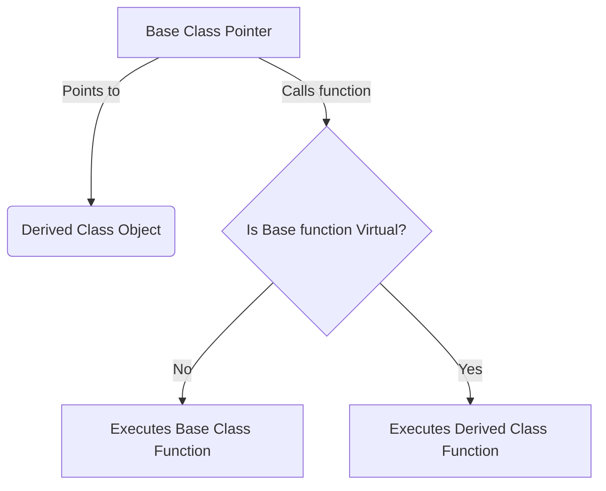

# Section 16: Polymorphism

## Function Overriding
* **Definition:** A function redefined in a child class which is already defined in the parent class.
* **Key Concept:** Redefining a function of the parent class again in the child class.
* **Rule:** Function overriding means the **prototype** (return type, name, arguments) of a function must be **exactly the same**. It cannot have any variation.
* **Note:** If the signature/prototype is not exactly the same, it is treated as *Function Overloading*, not Overriding.

### Example Code (Overriding)
```cpp
class Parent {
public:
    void display() {
        cout << "Display of Parent";
    }
};

class Child : public Parent {
public:
    void display() { // Overriding the parent function
        cout << "Display of Child";
    }
};
```

---

## Virtual Functions

* **The Problem:** When we create a pointer of a **Base class** and point it to an object of a **Derived class**, and both have a function with the same name (overriding). If we call the function using the base pointer, the **Base class function** is called by default.
* **The Solution:** To execute the correct function (the one belonging to the object, i.e., the Derived class), we use **Virtual Functions**.
* **How:** Add the keyword `virtual` before the function in the Base class. Now, if we call the function using a Base class pointer pointing to a Derived object, the **Derived class function** will be called.

### Visualizing the Concept (Mermaid)



### Example Code (Virtual Functions)

```cpp
class Base {
public:
    virtual void fun() { // 'virtual' keyword enables runtime polymorphism
        cout << "Fun of Base";
    }
};

class Derived : public Base {
public:
    void fun() {
        cout << "Fun of Derived";
    }
};

int main() {
    Base *p = new Derived(); // Base pointer, Derived object
    p->fun(); // Calls Derived::fun() because Base::fun() is virtual
}
```

### Programmer's Control

If we have a pointer of Base class pointing to an object of Derived class, the behavior depends on the programmer:

* **Don't make it virtual:** Base class function will be called.
* **Make it virtual:** Derived class function will be called.

---

## Runtime Polymorphism

This behavior is called **Runtime Polymorphism**. By using a Base class pointer pointing to a Derived class object, and declaring the base function as `virtual`, the overridden function in the derived class is called based on the actual object type at runtime.

**Three requirements to achieve Runtime Polymorphism:**

1. **Base class pointer** pointing to a Derived class object.
2. **Function Overriding** (same prototype in both classes).
3. **Virtual Function** in the Base class.

---

## Pure Virtual Functions & Abstract Classes

### The "Car" Analogy (Polymorphism)

* Imagine a class `Car`. Every car must `start` and `stop`.
* However, the implementation of `start` and `stop` might differ between a `Swift` and an `Innova`.
* We don't need to implement `start` and `stop` in the generic `Car` class, but we want to **force** all subclasses (Swift, Innova) to implement them.
* We achieve this using **Pure Virtual Functions**.

### Pure Virtual Function

* **Syntax:** Assign the virtual function to zero.
```cpp
virtual void start() = 0;
```


* **Definition:** A function that has no body in the base class and is assigned the value 0.
* **Rules:**
1. Derived classes **must override** (implement) these functions.
2. If a derived class does not override it, that derived class also becomes an **Abstract Class**.
3. The purpose of pure virtual functions is to achieve polymorphism and define an interface.


### Abstract Classes

* **Definition:** If a class has at least one **Pure Virtual Function**, it is called an **Abstract Class**.
* **Restriction:** You **cannot create an object** (instance) of an Abstract Class.
* **Usage:** You *can* create a **pointer** of an Abstract Class (to achieve polymorphism).

### Example Code (Abstract Class & Pure Virtual Functions)

```cpp
class Car { // Abstract Class
public:
    virtual void start() = 0; // Pure Virtual Function
    virtual void stop() = 0;  // Pure Virtual Function
};

class Swift : public Car {
public:
    void start() { cout << "Swift Started"; }
    void stop() { cout << "Swift Stopped"; }
};

class Innova : public Car {
public:
    void start() { cout << "Innova Started"; }
    void stop() { cout << "Innova Stopped"; }
};

int main() {
    Car *p = new Swift();
    p->start(); // Output: Swift Started
    
    p = new Innova();
    p->start(); // Output: Innova Started
}
```

---

## Summary Concepts

### Purpose of Inheritance

1. **Reusability:** The derived class borrows functionality from the base class (Concrete functions).
2. **Polymorphism:** The derived class MUST override a function to provide specific behavior (Pure Virtual functions).

### Concrete vs. Abstract Functions

* **Concrete Function:** A function defined and implemented in the class itself.
* **Abstract Class / Interface:** Useful for defining a blueprint (interface).

### Categorization of Classes (C++)

Based on the functions inside the Base Class:

1. **All Concrete Functions:** Used for **Reusability**.
2. **Some Concrete + Some Pure Virtual:** Used for **Reusability + Polymorphism** (Abstract Class).
3. **All Pure Virtual Functions:** Used for **Polymorphism** (Called an **Interface**).
* *Note:* In Java, "Interface" is a specific keyword. In C++, a class with only pure virtual functions acts as an interface.


### Final Key Points

* Function Overriding is for achieving Polymorphism.
* Base class functions must be `virtual` to achieve polymorphism.
* Runtime Polymorphism is achieved using a **Base Class Pointer** to a **Derived Class Object** calling an **Overridden Method**.
