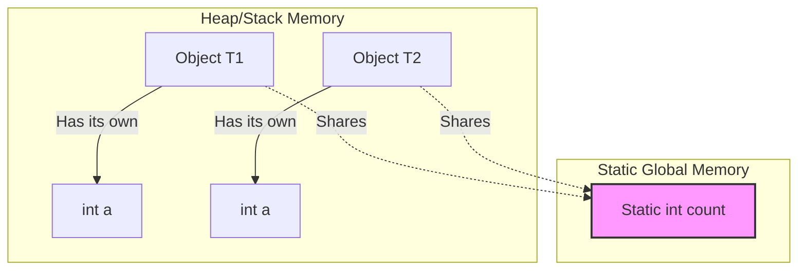

# Section 17: Friend and Static Members / Inner Classes

## Friend Functions
* **Definition:** A Friend function is a global function (outside function) which can access all the members of a class upon an object, not directly. It can access private, protected, and public members.
* **Declaration:** The class must explicitly declare that the function is a "friend," essentially saying: *"Though this function doesn't belong to us, it is a friend, so it can access all members of our objects."*
* **Usage:** This is useful mostly in operator overloading.

```cpp
class Test {
private:
    int a;
protected:
    int b;
public:
    int c;
    friend void func(); // Declaration
};

void func() {
    Test t;
    t.a = 10; // Accessing private
    t.b = 10; // Accessing protected
    t.c = 10; // Accessing public
}
```

---

## Friend Class

* If we want one class to access private members of another class *upon an object* (without inheritance), we have to declare the accessing class as a **friend** inside the target class.
* **Note:** You need to declare the friend class (e.g., `class Your`) before the target class (e.g., `class My`), otherwise the compiler will not recognize it (Forward Declaration).
* They can access members of objects of other classes.
* **Container Concept:** We can call the friend class a "container" of objects of the other class. If the container class needs to access private or protected members of the contained objects, we declare them as friends.

```cpp
class Your; // Forward declaration

class My {
private:
    int a = 10;
    friend Your; // Friend declaration
};

class Your {
public:
    My m;
    void fun() {
        // Accessing private member 'a' of class My
        // strictly upon the object 'm'
        std::cout << m.a; 
    }
};
```

---

## Static Members

* If we create an object of a class, every object will have its own data members declared in the class. However, if we make a data member **static**, it will remain the **same across all objects**.
* The static variable/member belongs to the **class**, not to every object.
* **Memory Allocation:** The static member memory is allocated only **one time** and shared among all objects.
* Since static variables belong to the class (not a specific object), all objects share that one copy. If one object changes it, the change is reflected for all.
* **Declaration Rule:** When we have a static variable inside the class, we must define/initialize it **outside** again using the scope resolution operator.
* `int ClassName::count = 0;`


* It functions like a global variable but is scoped to the class. It can be accessed using objects or the class name.

**Visualizing Static Memory:**



```cpp
class Test {
public:
    int a;
    static int count; // Declaration inside class

    Test() {
        a = 10;
        count++; // Increment shared count
    }
};

// Definition outside class is mandatory
int Test::count = 0; 

int main() {
    Test t1;
    Test t2;
    
    // Both t1.count and t2.count refer to the same memory
    std::cout << t1.count << std::endl; 
    std::cout << Test::count << std::endl; // Can access via Class Name
}
```

---

## Static Member Functions

* **Restriction:** Static member functions can access **only static data members** of a class. They cannot access non-static data members.
* Static member functions also belong to the class, not a specific object.

```cpp
class Test {
public:
    int a;
    static int count;

    // Static Function
    static int getCount() {
        // a++; // Error: Cannot access non-static member 'a'
        return count; // OK: Accessing static member
    }
};

int Test::count = 0;

int main() {
    // Calling without an object
    std::cout << Test::getCount(); 
    
    // Calling with an object (valid, but typically accessed via class)
    Test t;
    std::cout << t.getCount(); 
}
```

### Logic behind Static Members and Functions

* **Analogy:** If we go to a car showroom, we can know the price of a car (e.g., Innova) *without* buying the car.
* We have a class named `Innova`. We have a static member/function for `price`. We don’t need to create an object (buy the car) to access the price; we can access it using the class directly.

### Usage Points regarding Static Members

1. **Counters:** Static members can be used as counters (e.g., to count how many objects are active).
2. **Shared Memory:** Used as shared memory for all objects; one object writes, and others read the same data.
3. **Class Information:** Provide information about the class itself (e.g., car price is info about the model, not a specific car instance).

---

## Inner / Nested Classes

* **Definition:** Writing a class inside another class. This is useful when the inner class is relevant only within the context of the outer class.
* **Access Rules:**
* The Inner class can access members of the Outer class **if they are static**.
* The Outer class can create an object of the Inner class.
* Using that object, the Outer class can access **public** members of the Inner class. (It typically cannot access private/protected members of the inner class directly without friendship, though rules vary slightly by compiler context; standard practice is public access).


* **Scope:** It is a limited scope class, visible mainly inside the outer class.
* **Instantiation Outside:** We can create objects of the inner class outside the outer class using the scope resolution operator `::`, **only if the inner class is declared public**.

```cpp
class Outer {
public:
    void fun() {
        i.display(); // Outer accessing Inner via object
    }

    class Inner {
    public:
        void display() {
            std::cout << "Display of Inner" << std::endl;
        }
    };

    Inner i; // Outer class containing an object of Inner
};

int main() {
    // Object creation in main
    Outer::Inner i;
    i.display();
}
```

### Summary of Key Differences

* **Friend Class:** Can access private members of another class *upon its object*.
* **Static Functions:** Are functions of the class (global scope within class namespace), not tied to an instance.
* **Friend Functions:** Are global functions (not members) granted special access.
* **Invocation:** Static member functions can be called using the **Class Name** or an **Object**.
* **Purpose:** Static members are primarily used for providing information about the class or managing shared state.
