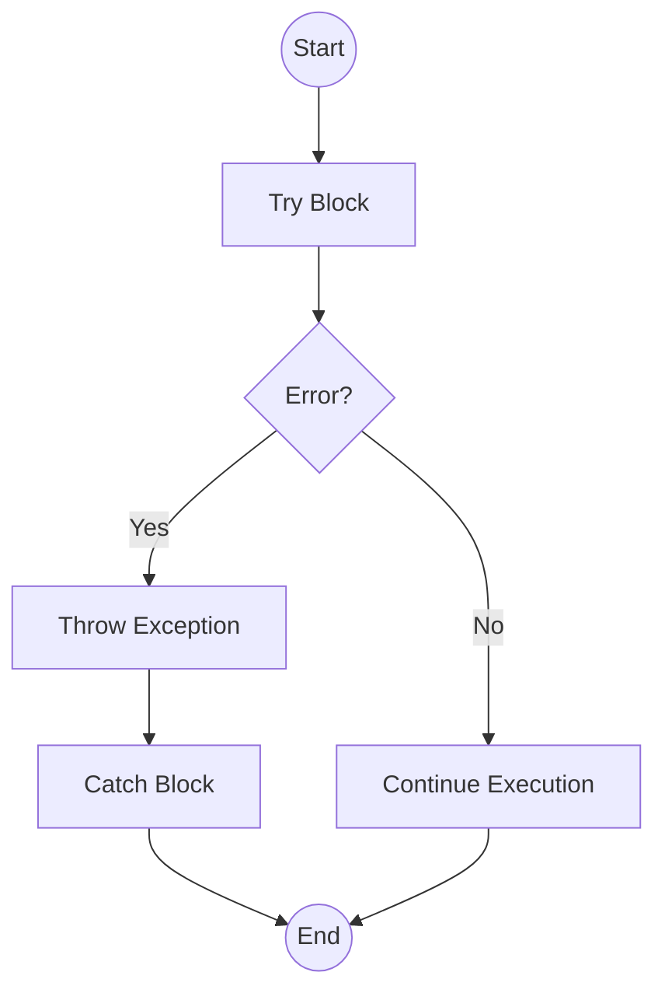
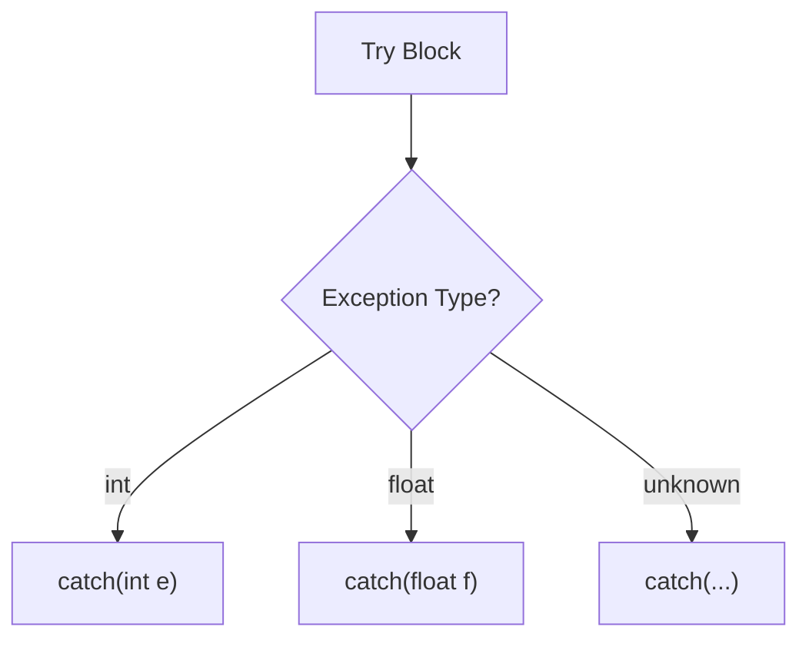

# Section 18: Exception Handling

### 3 Types of Errors
1.  **Syntax Error:** Removed using the help of the compiler.
2.  **Logical Error:** Program runs successfully, but the result is different/incorrect. The debugger helps us run the program line-by-line or statement-by-statement to find these.
3.  **Runtime Error:** Caused by bad input, unavailability, or problems with resources.

### Runtime Error
* In the case of a runtime error, the program crashes, stops abruptly, or terminates abnormally without completing its execution. Suddenly, it will stop.
* That is why runtime errors are dangerous for the user.
* **Responsibility:** The user is often responsible because, assuming the developer did their job perfectly, the user might not be providing proper resources or proper input, causing the program to fail. Thus, the failure of the program often goes to the user.

### Exception
* These runtime errors are called **Exceptions**. We use the term "Exception" because they occur in exceptional cases.
* **Objective of Exception Handling:**
    * Handling the error gracefully.
    * Giving a proper message to the user informing them about the exact problem.
    * Providing guidance to solve that problem.

---

## Exception Handling Structure

### Construct/Structure
The basic structure involves `try` and `catch` blocks.



* **Try Block (`try { ... }`):**
* If there is any error on any line inside the `try` block, it will stop execution at that line and jump to the `catch` block.
* If there is *no* error in the `try` block, the `catch` block will **not** execute.


* **Catch Block (`catch() { ... }`):** Executes statements to handle the error.
* It is similar logic to `if-else`.

### Throwing Mechanism

* In the line `throw 101;`, we are throwing an exception manually.
* We have to throw exceptions in C++ explicitly for logic errors (like division by zero) because the C++ compiler/runtime doesn't have a built-in mechanism to automatically throw exceptions for math errors (unlike Java).
* `throw 101` will be caught by the catch block argument, e.g., `catch(int e)`, where `e` becomes `101`.

#### Code Example: Basic Try-Catch

```cpp
#include <iostream>
using namespace std;

int main() {
    int a = 10, b = 0, c;
    
    try {
        if (b == 0) {
            throw 101; // Throwing an integer exception
        }
        c = a / b;     // This line won't execute if b is 0
        cout << c;
    }
    catch (int e) {
        // e receives the value 101
        cout << "Exception occurred: Division by zero. Error Code: " << e;
    }
}
```

---

## Throw and Catch between Functions

* Exception handling is primarily used to communicate errors *between* functions (e.g., a worker function telling the main function something went wrong).
* If everything is in one function, simple `if-else` logic often suffices. Exception handling is more useful for separating error detection from error handling.

#### Code Example: Function Communication

```cpp
#include <iostream>
using namespace std;

// Function performing the division
int division(int a, int b) {
    if (b == 0) {
        throw 1; // Throw exception to the caller
    }
    return a / b;
}

int main() {
    int x = 10, y = 0, z;
    
    try {
        z = division(x, y); // Calls function
        cout << z << endl;
    }
    catch (int e) {
        cout << "Division by zero! Error: " << e << endl;
    }
    
    cout << "Bye" << endl; // Program continues gracefully
    return 0;
}
```

---

## More about Throw

* We can throw anything: `int` value, `float`, `double`, `char`, `string`, or even our **own class object**.
* **Exception Specification (Legacy):**
* We can mention in the function signature that a function throws an exception:
`int division(int x, int y) throw(MyException) { ... }`
* *Note: This signals to other programmers via the signature that this function might throw specific exceptions, so they are supposed to catch them.*


#### Code Example: Throwing Class Objects

```cpp
class MyException : public exception {
    // Custom exception class details
};

int division(int x, int y) {
    if (y == 0) {
        throw MyException(); // Throwing an object
    }
    return x / y;
}
```

---

## More about Catch

### Multiple Catch Blocks

* We can have multiple `catch` blocks to handle different types of data thrown.
* **`catch(...)` (The Ellipsis / "Catch-All"):**
* It can catch **any** type of exception.
* If we use this, it means we aren't interested in (or able to) give a specific message based on the data type.
* It is recommended to have multiple specific `catch` blocks for different data types first.
* **Important:** The `catch(...)` block must be defined as the **last** catch block.




#### Code Example: Multiple Catches

```cpp
try {
    // Some code that might throw different types
    if (error_type == 1) throw 10;      // int
    if (error_type == 2) throw 1.5;     // double
    if (error_type == 3) throw "Error"; // string
}
catch (int e) {
    cout << "Caught Integer: " << e;
}
catch (double d) {
    cout << "Caught Double: " << d;
}
catch (...) {
    cout << "Catch-All Executed: Unknown Exception";
}
```

### Important Points

* We can have a `try` block inside another `try` block (Nesting of try-catch).
* **Inheritance in Catch Blocks:**
* If exception classes are in an inheritance hierarchy, you must write the `catch` for the **Child class first**, and then the **Parent class**.


* `void fun() throw()` means the function guarantees it throws **no** exception.
* Exceptions are raised by the program.
* A `try` block can have multiple `catch` blocks.
