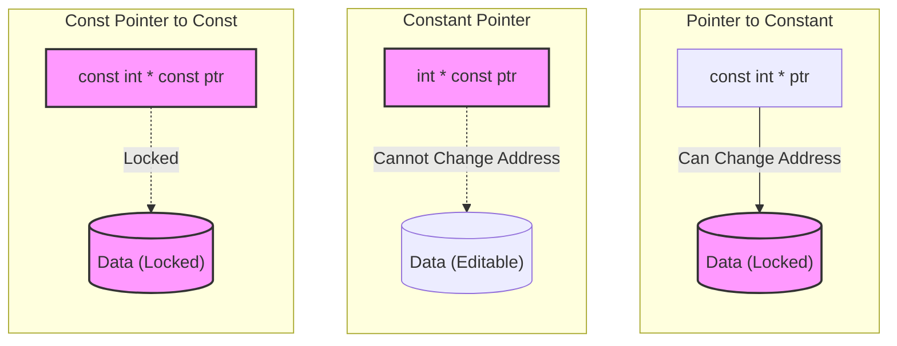

# Section 20: Constants, Preprocessor Directives, and Namespaces

## 1. Constants
**Syntax:** `const int x = 10;`

* `x++` or `x = 5` is **not allowed**.
* It is a constant identifier, not a variable.
* When we say "constant", it means we cannot modify its value.
* `int const x = 10;` is the same as `const int x = 10;`.
* `int *ptr = &x` is **not allowed**.
    * We cannot store the address of a constant identifier in a normal pointer.
    * *Reason:* It would risk violating the constant nature of `x`.
* **Exception:** We *can* have a pointer to a constant: `const int *ptr = &x;`.

> **Summary:** Constant identifiers cannot be modified throughout the program.

### Constants vs. Preprocessor Directives (`#define`)

**We also use `#define x 10`. What is the difference?**

| Feature | `#define x 10` | `const int x = 10;` |
| :--- | :--- | :--- |
| **Type** | Preprocessor Directive (Symbolic Constant). | Constant Identifier. |
| **Scope** | Global (unless undefined). Part of the pre-compiler. | Follows variable scope rules. Part of the language/compiler. |
| **Memory** | Does **not** consume memory (text replacement). | Consumes memory. |
| **Usage** | Good for global constraints used everywhere. | Good for constants inside functions/classes. |

---

## 2. Constant Pointers & Pointers to Constants

This often gets confusing. Here is the breakdown:

### A. Pointer to a Constant (`const int *ptr`)
* **Syntax:** `const int *ptr = &x;`
* **Meaning:** The pointer `ptr` points to `x`. It can read `x`, but it **cannot modify** `x`.
* The pointer treats the data as read-only.
* `int const *ptr = &x;` is the same as `const int *ptr = &x;`.
* **Flexibility:** We *can* make the pointer point to something else (change the address), but we still cannot modify the data it points to.

### B. Constant Pointer (`int *const ptr`)
* **Syntax:** `int *const ptr = &x;`
* **Meaning:** The **data is not constant**, but the **pointer is constant**.
* Once `ptr` points to `x`, we **cannot** change it to point to something else.
* **Flexibility:** The data is not locked; we can modify the value of `x` through the pointer.

### C. Constant Pointer to a Constant (`const int *const ptr`)
* **Syntax:** `const int *const ptr = &x;`
* **Meaning:** Both the pointer and the data are locked.
* You cannot change where the pointer points.
* You cannot modify the data through the pointer.



---

## 3. Const in Functions

### Member Functions

If we want to restrict a function from modifying the data members of a class, we add `const` to the function definition.

```cpp
void Display() const {
    // Cannot modify class variables here
}
```

### Call by Reference

In standard Call by Reference, the function accesses the actual memory location, meaning it *can* modify the original variable. If we want efficiency (no copying) but safety (no modification), we use `const`.

```cpp
void fun(const int &x, int &y);
```

* `x` cannot be modified by `fun`.
* Parameters can also be made constants.

---

## 4. Preprocessor Directives / Macros

These are instructions to the compiler performed *before* the compilation process starts.

### Defining Constants

```cpp
#define PI 3.14
```

* Wherever we use `PI`, the value `3.14` is replaced textually.
* The compiler sees `3.14` everywhere, not `PI`.
* In machine code: It is `cout << 3.14`, not `cout << PI`.

### Defining Aliases

```cpp
#define C count
// usage
C << 10; // becomes count << 10;
```

### Macros (Functions)

We can define small functions using `#define`.

```cpp
#define SQR(x) (x*x)
```

* If we write `SQR(5)`, it is replaced by `5*5` before compilation.

### Stringifying Operator (`#`)

```cpp
#define MSG(x) #x
```

* This converts whatever `x` is into a string (adds double quotes).
* `cout << MSG(Hello);` is equal to `cout << "Hello";`

### Include Guards (`#ifndef`)

Used to prevent header files from being included multiple times.

```cpp
#ifndef PI
    #define PI 3.1425
#endif
```

* *Logic:* Define `PI` only if it is not already defined.
* If we don't use `#ifndef` and `PI` was defined earlier, it gives an error. It is recommended to use this structure.

---

## 5. Namespaces

* **Problem:** If we have 2 functions with the same name, it gives a compiler error.
* **Solution:** To remove this ambiguity, we use **Namespaces**.
* Namespaces group classes, objects, and functions into logical units.
* **Scope Resolution Operator (`::`):** Used to access the namespace.

### Example Code

```cpp
#include <iostream>
using namespace std;

namespace first {
    void fun() {
        cout << "First\n";
    }
}

namespace Second {
    void fun() {
        cout << "Second\n";
    }
}

using namespace first;

int main() {
    fun();              // Calls fun() from 'first' due to 'using namespace first'
    Second::fun();      // Calls fun() from 'Second' explicitly
    std::cout << "Bye\n";
    return 0;
}
```

### Key Notes:

* We can keep namespaces in separate files, include the header file, and use that namespace in our main function.
* **Syntax for accessing:** `namespace::variable`
* **Keyword to bring into scope:** `using` (e.g., `using namespace std;`)
