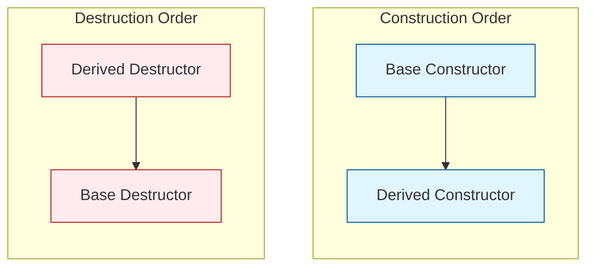

# Section 21: Destructor and Virtual Destructors

## Destructor
* We know whenever we create an object of a class, a constructor will be called.
* We can write a similar thing like a constructor; the only difference is the tilde `~` symbol is used before the function name.
* **Constructor:** `Test() { ... }`
* **Destructor:** `~Test() { ... }` // This function is called when the object is destroyed.

### Basic Example
So, the constructor is called when the object is created. The destructor is called when the object is destroyed.

```cpp
class Test {
public:
    Test() {
        cout << "Test created";
    }

    ~Test() {
        cout << "Test destroyed";
    }
};

int main() {
    // Constructor is called here
    Test *p = new Test(); 
    
    // ...
    
    // When we call delete p, it means destructor is called
    delete p; 
}
```

### Use Case: Resource Management

* **Constructor:** Used for initialization purposes. It is also used for allocating resources.
* **Destructor:** Used for deallocating resources, releasing the resources (like closing files or freeing memory).

**Example of Resource Management:**
In the example below, the constructor is used for acquiring resources (memory allocation, file opening) and the destructor is used for releasing them.

```cpp
class Test {
    int *p;
    ifstream fin;

public:
    Test() {
        p = new int[10];      // Allocating memory
        fin.open("my.txt");   // Opening file
    }

    ~Test() {
        delete [] p;          // Releasing memory
        fin.close();          // Closing file
    }
};
```

> **Note:** We can have multiple constructors (Overloading), but we **cannot** have multiple destructors.

### Complete Flow Example

```cpp
class Demo {
public:
    Demo() {
        cout << "Constructor is called\n";
    }
    
    ~Demo() {
        cout << "Destructor is called\n";
    }
};

void fun() {
    Demo d; // Local object, destroyed when fun() ends
}

int main() {
    fun();

    Demo *p = new Demo(); // Dynamic object
    cout << "Destructor still not called\n";
    cout << "Need to delete the memory\n";
    
    delete p; // Explicit deletion triggers destructor
    cout << "Now destructor was called\n";
    
    return 0;
}
```

---

## Destructor in Inheritance

How are constructors and destructors called when we create an object of a Derived class?

`Derived d;`

1. **Calling of Constructor (Top to Bottom):**
* Base Constructor
* Derived Constructor


2. **Calling of Destructor (Bottom to Top):**
* Derived Destructor
* Base Destructor




---

## Virtual Destructor

**Scenario:**

```cpp
Base *p = new Derived();
// ...
delete p;
```

* In C++, functions are called depending on the pointer type, not the object type (static binding).
* Since the pointer is of the **Base** class, only the **Base class destructor** will be called.
* The C++ compiler thinks the object is of the Base class because we are using a Base pointer.
* So, when we call `delete p`, only the Base Destructor is executed. This causes a memory leak if the Derived class allocated resources.

**Solution:**
We want it to work normally: first the destructor of Derived, then Base. To achieve this, we have to write `virtual` before the base class destructor.

```cpp
virtual ~Base() { ... }
```

### Virtual Destructor Example Code

```cpp
class Base {
public:
    Base() {
        cout << "Base Constructor is called\n";
    }
    
    // Virtual keyword ensures Derived destructor is called first
    virtual ~Base() {
        cout << "Base Destructor is called\n";
    }
};

class Derived : public Base {
public:
    Derived() {
        cout << "Derived Constructor is called\n";
    }
    
    ~Derived() {
        cout << "Derived Destructor is called\n";
    }
};

int main() {
    Base *p = new Derived();
    delete p;
    return 0;
}
```

* It is useful for **runtime polymorphism**.

---

## Summary Points

* **Destructor:** A special function that is called to free the resources acquired by the object.
* **When is a destructor called?** Just before the end of the object's life.
* **Multiple Inheritance Sequence:** If Class C inherits Class B, and Class B inherits Class A (`A -> B -> C`). If an object of Class C is destroyed, the sequence is:
1. `~C()`
2. `~B()`
3. `~A()`


* **Global Object Destructor:** When is the destructor of a global object called?
* Just before the end of the program.
