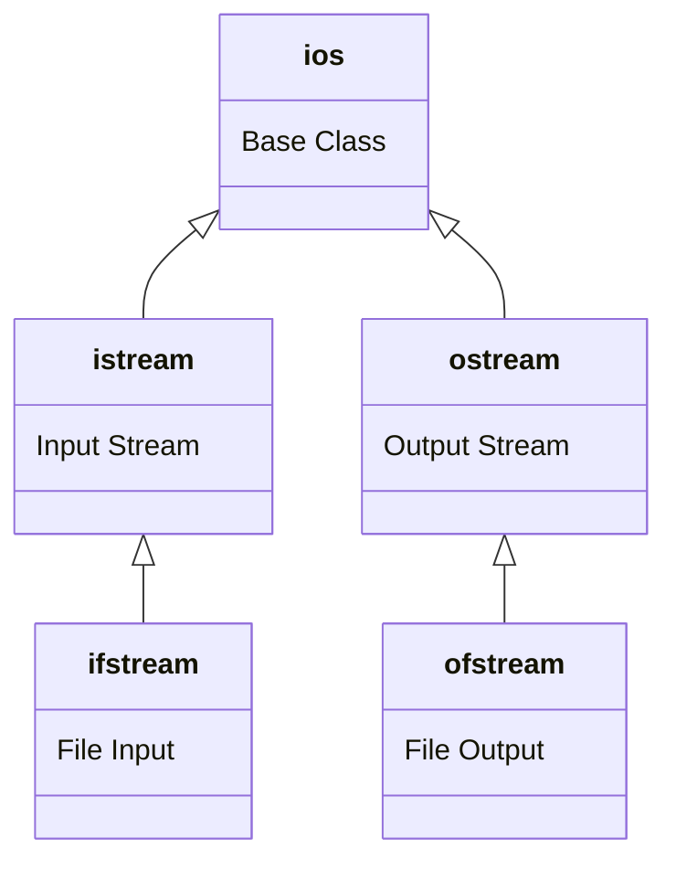
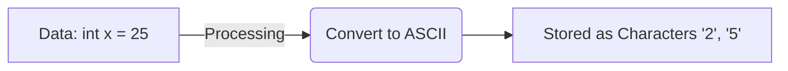

# Section 22: I/O Streams

## Streams Overview

* **Required Header:** `#include <fstream>`
* **Definition:** A stream is a flow of data or flow of characters.
* Streams are used for accessing data from outside the program (external sources or destinations).
* **I/O Streams** = Input/Output Streams.
* C++ provides built-in classes for accessing input/output stream classes.

### Stream Class Hierarchy
The base class `ios` branches into input and output streams.



---

## Writing into a File

* We can use the same insertion (`<<`) operator for writing into a file as we do with `cout`.
* **Class used:** `ofstream` (Output File Stream).

### Opening Modes

1. **Default/Truncate (`ios::trunc`):**
* `ofstream outfile("my.txt");` is the same as `ofstream outfile("my.txt", ios::trunc);`
* If the file does not exist, it will create a new file with that name.
* If the file **already exists**, it will **truncate** (remove) the existing content before writing.


2. **Append (`ios::app`):**
* If we want to keep existing content, we change the mode to append.
* `ofstream outfile("my.txt", ios::app);`


### Syntax Example

```cpp
#include <fstream>
#include <iostream>
using namespace std;

int main() {
    // Open file to write
    ofstream outfile("my.txt"); 
    
    // Writing data
    outfile << "Hello" << endl;
    outfile << "How are you?" << endl;
    
    // Always close the file
    outfile.close(); 
    return 0;
}
```

---

## Reading Data from a File

* **Class used:** `ifstream` (Input File Stream).
* **Modes/Flags available:**
* `ios::in` (Input)
* `ios::out` (Output)


### Critical Checks

When reading, the file **must exist**.

1. **Check existence:**
```cpp
if (!infile) {
    cout << "File cannot open";
}
// OR
if (infile.is_open()) { ... }
```


2. **Check End of File (EOF):**
```cpp
if (infile.eof()) {
    cout << "End of file reached";
}
```


### Reading Syntax

**Important:** You must know the format of the data in the file (int, string, etc.) to read it correctly.

```cpp
#include <fstream>
#include <iostream>
#include <string>

using namespace std;

int main() {
    ifstream infile;
    infile.open("my.txt");
    
    if(!infile.is_open()) {
        cout << "File not found" << endl;
        return 0;
    }

    string str;
    int x;
    
    // Reading data types specifically
    infile >> str; // Reads a string
    infile >> x;   // Reads an integer
    
    infile.close();
    return 0;
}
```

---

## Serialization

* **Definition:** The process of storing and retrieving the state of an object.
* To store and retrieve complex objects in a file, we must overload the insertion (`<<`) and extraction (`>>`) operators.

### Example Structure

```cpp
class Student {
public:
    string name;
    int age;
    
    // Overloading insertion for writing to file
    friend ofstream & operator<<(ofstream &ofs, Student &s);
    
    // Overloading extraction for reading from file
    friend ifstream & operator>>(ifstream &ifs, Student &s);
};
```

---

## 2 Types of Files

### 1. Text Files

* **Visualizing Storage:**



* If we open this in Notepad, it converts every 8 bits into an ASCII code and displays a symbol/character.
* **Space:** Takes more space (due to conversion overhead).
* **Speed:** Slower because reading/writing requires conversion logic.

### 2. Binary Files

* **Visualizing Storage:**


* If we open this in Notepad, it might print junk data because the raw binary doesn't always map to meaningful ASCII codes.
* **Mode:** Must use `ios::binary`.
* **Functions:** Uses `read()` and `write()`.
* **Speed:** Faster (no conversion needed).

---

## Manipulators

* Manipulators are used for enhancing or formatting streams.
* To use manipulators with arguments, you may need `#include <iomanip>`.

### Common Examples

| Manipulator | Purpose | Example | Result |
| --- | --- | --- | --- |
| `endl` | New line | `cout << endl;` | Moves cursor to next line |
| `\n` | New line | `cout << "\n";` | Moves cursor to next line |
| `hex` | Hexadecimal | `cout << hex << 163;` | Displays `a3` |
| `dec` | Decimal | `cout << dec << 163;` | Displays `163` |
| `fixed`/`scientific` | Float formatting | `cout << fixed;` | Fixed point notation |

---

## Key Takeaways / Summary

* **Header:** `#include <fstream>` is used for reading and writing to a file.
* **Operators:** * `<<` is used to insert data into a file.
* `>>` is used to extract data from a file.


* **Check Open:** `is_open()` member function determines if the stream object is currently associated with a file.
* **Console Objects:** There are 3 standard C++ objects for console I/O:
* `cin` (Input from keyboard)
* `cout` (Output to screen)
* `cerr` (Error output)


* **File Positioning:** `seekg` function is used to change the position of the file pointer (e.g., move backward from the end of the file for reading).
