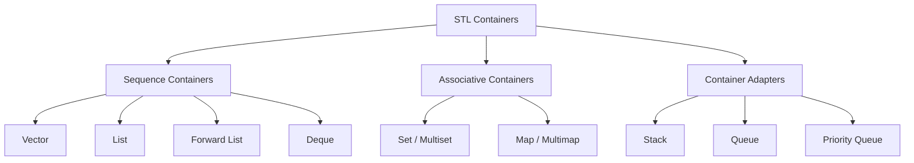

# Section 23: Standard Template Library (STL)

## What is STL?
* **STL (Standard Template Library):** A collection of built-in classes in C++ meant for managing collections of data.
* It consists of generic classes and functions (templates) that allow developers to write efficient and reusable code.

---

## Data Structures
**Definition:** A data structure is a collection of data and the arrangement of that data for its efficient utilization.
* Depending on our utilization, we can arrange the data so that it can be utilized efficiently.
* **Efficiency:** Measured in terms of **Time** and **Space**. We want data to be stored/retrieved easily (Time) and occupy less memory (Space).

### Types of Data Structures
* **Array:** Size is fixed.
* **Singly Linked List:** Size is variable (Forward pointer only).
* **Doubly Linked List:** Forward and Backward pointers.
* **Stack:** LIFO (Last In, First Out).
* **Queue:** FIFO (First In, First Out).
* **Deque:** Double-ended queue.
* **Priority Queue:** Elements are sorted by priority.
* **Map:** Key-Value pairs.
* **Set:** Collection of unique keys.

> **Note:** C++ provides a built-in library of classes for all of these data structures, known as the **STL**.

---

## Components of STL
The STL consists mainly of **Algorithms**, **Containers**, and **Iterators**.

### 1. Algorithms
Built-in functions meant for managing containers and performing operations on them.
* `Search()`
* `Sort()`
* `Binary_search()`
* `Reverse()`
* `Concat()`
* `Copy()`
* `Union()`
* `Intersection()`
* `Merge()`
* `Heap()`

### 2. Containers
Containers are objects that hold a collection of data (a list of data). They are implemented as template classes (generic), meaning they can work for any data type.

#### Classification of Containers


#### Detailed Container List

**A. Vector**

* Like an array, but the size is **not fixed** (dynamic array).
* **Functions:**
* `push_back()`: Insert at the end.
* `pop_back()`: Delete from the end.
* `insert()`: Insert at a specific index.
* `remove()`: Remove elements.
* `size()`: Returns current size.
* `empty()`: Checks if vector is empty.


**B. List**

* Implemented as a **Doubly Linked List**.
* **Functions:** Same as Vector, plus insertion/deletion is efficient from both ends.
* `push_front()`
* `pop_front()`
* `front()`: Access first element.
* `back()`: Access last element.


**C. Forward_list (Introduced in C++11)**

* Implemented as a **Singly Linked List**.
* **Functions:** Same as List, but **`push_back` is not available** (expensive for singly linked lists).

**D. Deque (Double Ended Queue)**

* Similar to a vector (arrays), but allows insertion/deletion from **both ends** (front and back).
* **Functions:** Same as List.
* *Comparison:* `list`, `forward_list`, and `deque` share many functions, but `vector` cannot efficiently insert/delete from the front.

**E. Priority_queue**

* Implemented using **Heap Data Structure**.
* **Max Heap:** Whenever we `pop()`, the largest element is deleted.
* **Functions:**
* `push()`
* `pop()`
* `empty()`
* `size()`


**F. Stack**

* **LIFO** (Last In, First Out).
* **Functions:** Same as `priority_queue`.

**G. Set**

* Collection of **unique** elements.
* Duplicates are **not allowed**.
* Order is usually sorted.
* **Functions:** `insert()`.

**H. Multiset**

* Same as Set but **allows duplicates**.

**I. Map**

* Stores **Key-Value pairs**.
* Uses a Hash Table (or Tree).
* Keys must be **unique**.

**J. Multimap**

* Same as Map but **keys can be duplicate**. (However, exact same key-value pairs should not be redundant).

**K. Queue**

* **FIFO** (First In, First Out).
* **Functions:**
* `empty()`
* `size()`
* `swap()`: Exchange contents of two queues (must be same type, sizes can differ).
* `front()`
* `back()`
* `push(x)`: Adds element `x` to the end (rear).
* `pop()`: Deletes the first element (front).
* `emplace()`: Construct and insert element at the end.


### 3. Iterators

* Used for iterating (traversing) through a collection of values.
* Available for accessing all containers.
* Act like pointers to elements inside the collection.

---

## Usage Examples (Code)

### Basic Vector Usage

```cpp
#include <iostream>
#include <vector>
using namespace std;

int main() {
    // 1. Create Object
    vector<int> v; 
    
    // Alternative declarations:
    // vector<int> v(5);          // Size 5
    // vector<int> v = {10, 20};  // Initial values
    
    // 2. Insertion
    v.push_back(10); 
    v.push_back(20); 
    v.push_back(30); 
    
    // 3. Deletion
    v.pop_back(); // Removes 30
    
    return 0;
}
```

### Iterating through Containers

There are two main ways to iterate:

**1. Range-based for loop (C++11)**

```cpp
for (int x : v) {
    cout << x << endl;
}
```

**2. Using Iterator Classes**
`begin()` points to the first element. `end()` points to the position *after* the last element.

```cpp
#include <iostream>
#include <vector>
using namespace std;

int main() {
    vector<int> v = {10, 20, 30, 40};
    
    // Declaration
    vector<int>::iterator itr;
    
    // Loop
    for(itr = v.begin(); itr != v.end(); itr++) {
        // Need to dereference (*) because iterator is like a pointer
        cout << *itr << endl; 
    }
    
    // Modifying values using iterators
    for(itr = v.begin(); itr != v.end(); itr++) {
        *itr = *itr + 1; // Increment value by 1
        cout << *itr << endl; 
    }
    
    return 0;
}
```

**Note:**

* `rbegin()` and `rend()` are available for reverse traversal (from the rear end).
* The ability to modify values via iterators (`++*itr`) makes C++ very powerful.
* This concept is similar to the **Collection Framework** in Java.

### Map Usage Example

```cpp
#include <iostream>
#include <map>
#include <string>
using namespace std;

int main() {
    map<int, string> m;
    
    // Insertion
    m.insert(pair<int, string>(1, "John"));
    m.insert(pair<int, string>(2, "Ravi"));
    m.insert(pair<int, string>(3, "Khan"));
    
    // Iteration
    map<int, string>::iterator itr;
    for(itr = m.begin(); itr != m.end(); itr++) {
        cout << itr->first << " " << itr->second << endl;
    }
    
    // Access using iterator:
    // itr->first  gives the Key
    // itr->second gives the Value
    
    return 0;
}
```

---

## Conceptual Review Questions

**Q: From where does insertion and deletion get accomplished in Queues?**

* **Rear** for insertion.
* **Front** for deletion.

**Q: Which entities are essential for an Array Representation of a Queue?**

1. An array to hold queue elements.
2. A variable to hold the index of the **front** element.
3. A variable to hold the index of the **rear** element.

**Q: What is the 'next' field of a structure node in a Queue (Linked List implementation)?**

* It stores the address of the next node, holding the next element of the queue.

**Q: Which assertion is mainly associated with the feature of Spooling?**

* Maintenance of a queue of jobs to be printed.

**Q: Where is the root directory of a disk placed?**

* At a fixed location on the system disk.
