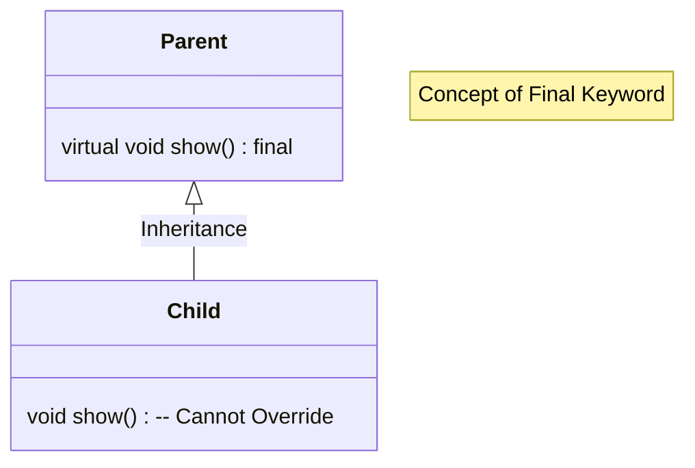
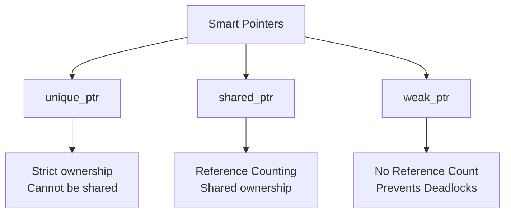

# Section 24 : C++ 11

## Auto
* When we don't know the data type that we require or it depends on the result, then we can declare it as `auto`.
* Example:
    ```cpp
    auto x = 2 * 5.7 + 'a';   // automatically it will become double
    cout << x;
    ```
* We can use `auto` when we are calling a function and we don't know what the return type of that function is.

**decltype**
* One more feature of C++11 is when we want to copy the data type of another variable but we don't know its data type, but we have the variable name, then we can use `decltype` function.
    ```cpp
    float y = 10.5;
    decltype(y) z = 12.5; 
    ```
    * Data type of `z` will be the same as the data type of `y`.
    * Variable `z` will be of float type because `y` is of float type.

---

## Final Keyword
* One usage of `final` is to restrict inheritance.
* If we declare a class as `final` then it can't be inherited.
* **Virtual Functions:** Only virtual functions can be marked as `final`.
* The `final` function of a parent class cannot be overridden in the child class.



* **Summary:** `final` keyword is used in C++ for restricting inheritance as well as restricting overriding of functions.
* **Comparison:** Same feature is available in Java also. The only difference is the `final` keyword is used *before* the return type of a function in Java, whereas in C++ it is written *after* the name of a function or after the parameter list.

---

## Lambda Expressions

* It is useful for defining unnamed functions.
* **Syntax:**
```cpp
[capture_list](parameter_list) -> return_type { body };
```


**Examples:**

1. **Define and call a function to print "Hello":**
```cpp
[]() { cout << "Hello"; } ();    // () at the end is for calling the function.
```


2. **With parameters:**
```cpp
[](int x, int y) { cout << "sum: " << x + y; };
```


* *For calling:*
```cpp
[](int x, int y) { cout << "sum: " << x + y; } (10, 5); // passing 10 and 5
```


3. **With return type:**
```cpp
int x = [](int x, int y) { return x + y; } (10, 5);
```


* I don't have to mention the return type, because C++ supports `auto` type deduction. So automatically, whatever the data type is, that data type is returned.


4. **Assigning to a variable:**
Instead of calling the function immediately, we can assign it to an `auto` variable.
```cpp
auto f = []() { cout << "Hello"; };
f(); // Calling the function using reference f
```


5. **Explicit Return Type:**
If we want to mention the return type (optional):
```cpp
int s = [](int x, int y) -> int { return x + y; } (10, 5);
```


**Capture List:**

* We can access the local variables of a function inside an unnamed function (lambda), but we need to capture them using `capture_list`.
* **By Value:** If we want to access all things in scope by value, write `=`.
* *Note:* We cannot modify captured variables by value directly (e.g., `a++` won't work unless `mutable` is used, or captured by reference).


* **By Reference:** If we want to access all things in scope by reference, write `&`.
* To modify captured variables, we usually use reference.


**Applications:**

* We can send a lambda expression to a function as a parameter.
* Lambda expressions are very flexible for defining the scope of a function within a line or block of statements. Helpful for nested functions.
* This is a feature of **functional programming** often used in AI.

---

## Smart Pointers

* Pointers are used for accessing resources external to the program, like Heap Memory.
* **The Problem:** With standard heap memory, we must manually deallocate it. If we forget, it causes **Memory Leakage**.
* **Solution:** C++ provides smart pointers which automatically manage memory. When the pointer goes out of scope, it automatically deallocates the memory.
* Defined in header: `#include <memory>`



### 1. unique_ptr

* Instead of `Rectangle *p = new Rectangle(10, 5);`, we write:
```cpp
unique_ptr<Rectangle> p1(new Rectangle(10, 5));
cout << p1->area();
```


* `unique_ptr` takes care of deletion when it goes out of scope.
* Only **one** pointer can point to the object. We cannot share the object with another pointer.
* We can transfer control to another pointer using `std::move`, removing the first pointer.

### 2. shared_ptr

* Syntax:
```cpp
shared_ptr<Rectangle> p1(new Rectangle(10, 5));
```


* More than one pointer can point to the same object.
* It maintains a **Reference Counter** (`ref_counter`) to track how many pointers are pointing to the object.
* We can check the count using `p1.use_count()`.

### 3. weak_ptr

* Same as shared pointer, but it **will not maintain a reference counter**.
```cpp
weak_ptr<Rectangle> p2(new Rectangle(10, 5));
```


* It holds a "weak" reference. It does not have a strong hold on the object.
* **Use Case:** If pointers hold objects and request others, they may form a **deadlock**. Weak pointers are useful to avoid circular dependency deadlocks.
* It is strictly between unique and shared.

**Recommendation:** It is suggested to use `unique_ptr` or `shared_ptr` instead of normal pointers to avoid memory leaks. It acts like Garbage Collection.

---

## In-Class Initializer & Delegation of Constructors

### In-Class Initializer

* In C++11, direct initialization of variables inside the class definition is allowed.
```cpp
class Test {
    int x = 10; // Allowed in C++11
    int y = 20;
};
```


### Delegation of Constructors

* We can allow a non-parameterized constructor to call a parameterized constructor.
* One constructor can call another constructor within the same class.
```cpp
class Test {
    int x, y;
public:
    Test(int a, int b) { x = a; y = b; }

    // Delegation: Calling the parametrized constructor
    Test() : Test(1, 1) { } 
};
```


---

## Ellipses (Variable Argument Lists)

* Requires: `#include <stdarg.h>` or `#include <cstdarg>`
* Ellipses are used for taking a variable number of arguments in a function.
* *Example:* A function to find the sum of integers, where we can pass 2, 3, 5, etc., elements.
* We must tell the function how many arguments we are passing (usually the first argument).

**Syntax:**

```cpp
int sum(int n, ...) { 
    // code using va_list
}
```

**Calling:**

```cpp
sum(3, 1, 3, 3);          // n=3 elements
sum(5, 1, 4, 3, 10, 2);   // n=5 elements
```

* **Mechanism:** We use `va_list`, `va_start`, `va_arg`, and `va_end` functions to work with ellipses.
* This was a feature of C language (used in `printf` and `scanf`), now available in C++.
* *Note:* C++ also has function overloading and variadic templates which help with different numbers of arguments.
