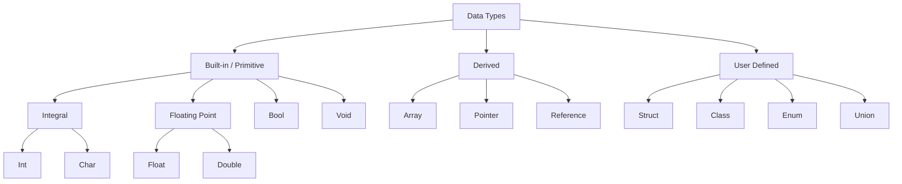

# Section 27: Miscellaneous #2

## Data Types
There are 3 main categories of data types in C++:

* **Built-in / Primitive**
    * **Integral**
        * `int`
        * `char`
    * **Floating Point**
        * `float`
        * `double`
    * **Boolean** (`bool`)
    * **Void** (`void`)
* **Derived**
    * Array
    * Pointer
    * Reference
* **User Defined**
    * Struct
    * Class
    * Enum
    * Union



---

## Data Type: Meaning and Size

| Type | Meaning | Typical Size (Bytes) |
| --- | --- | --- |
| `int` | Integer | 2 or 4 (Machine dependent) |
| `char` | Character | 1 |
| `float` | Floating Point | 4 |
| `double` | Double Floating Point | 8 |
| `bool` | Boolean | 1 |
| `void` | Valueless | 0 |
| `wchar_t` | Wide Character | 2 |

**Notes on Size and Encoding:**

* **ASCII & Unicode:**
* Standard ASCII is used for basic characters.
* **Unicode** (not unicorns) is used to support various national languages (Natural Languages).
* See http://www.unicode.org. While the data type (`wchar_t` etc.) is available, full Unicode support depends on the compiler/environment.


* **Integer Size:** The size of an `int` depends on the **word size** of the machine (the bit capacity the machine handles at once).
* **Void:**
* `void` means "nothing".
* We cannot declare a variable of type `void` (e.g., `void x;` is invalid).
* However, we **can** declare a pointer of type `void`:
```cpp
void *ptr; // Valid generic pointer
```

---

## Variables and Literals

### Definition

* Variables (also called **identifiers**) are names given by the programmer to store data.
* A variable must be declared before use. Declaration reserves memory in the Stack.

### Declaration and Initialization

```cpp
int marks;        // Declaration
marks = 100;      // Assignment (100 is the Literal)
```

**Valid vs Invalid Declarations:**

* Variables cannot start with a number (e.g., `1x` is invalid).
* Variables cannot contain special characters except underscore `_`.
* Variables cannot be keywords.

**Four Methods of Initialization:**

```cpp
int a = 10;     // 1. Copy Initialization
int b(10);      // 2. Direct Initialization
int c {10};     // 3. Uniform Initialization (C++11)
int d = {10};   // 4. Copy List Initialization
```

### Number Systems (Prefixes)

* **Decimal:** No prefix. `int x = 10;`
* **Octal:** Prefix with **`0`**. `int x = 012;` (Value is 10)
* **Hexadecimal:** Prefix with **`0x`**. `int x = 0xA;` (Value is 10)

### Literals and Suffixes

1. **Floating Point:**
* `float price = 12.5;` -> By default, `12.5` is treated as a `double`.
* `float price = 12.5f;` -> The `f` suffix explicitly makes it a `float` literal.
* *Note on assignments:* `int day = 1.7;` results in truncation (stores `1`).


2. **Long Integer:**
* `long distance = 65839L;` -> The `L` suffix specifies a `long` type.


3. **Scientific Notation:**
* `float a = 123e2;`  -> Represents 123 \times 10^2 = 12300
* `float a = 123e-2;` -> Represents 123 \times 10^{-2} = 1.23


4. **Characters vs Strings:**
* `char section = 'A';` -> Single quotes for `char`.
* `char section = 65;` -> Valid (uses ASCII value of 'A').
* `string name = "John";` -> Double quotes for `string`.
* *Note:* `string` is not a primitive type; it is a Class provided by C++.


5. **Boolean:**
* `bool b = true;`
* `bool b = 1;` (1 implies true, 0 implies false).


### Coercion

Implicit conversion of one data type to another by the compiler is called **Coercion**.

* *Example:* `char a = 65.5;`
* The float `65.5` is implicitly converted to integer `65`, then stored as char 'A'.


---

## Constructor in Inheritance

When creating an object of a **Derived** class:

1. The **Parent (Base)** class constructor is executed **first**.
2. The **Child (Derived)** class constructor is executed **second**.

**Calling a Parameterized Base Constructor:**
If the Parent class has a parameterized constructor, the Child class must explicitly call it using the initializer list syntax.

```cpp
class Base {
public:
    Base(int x) { 
        // Code... 
    }
};

class Derived : public Base {
public:
    // Syntax to call Base constructor
    Derived(int a, int b) : Base(a) {
        // Derived class constructor code...
    }
};
```
